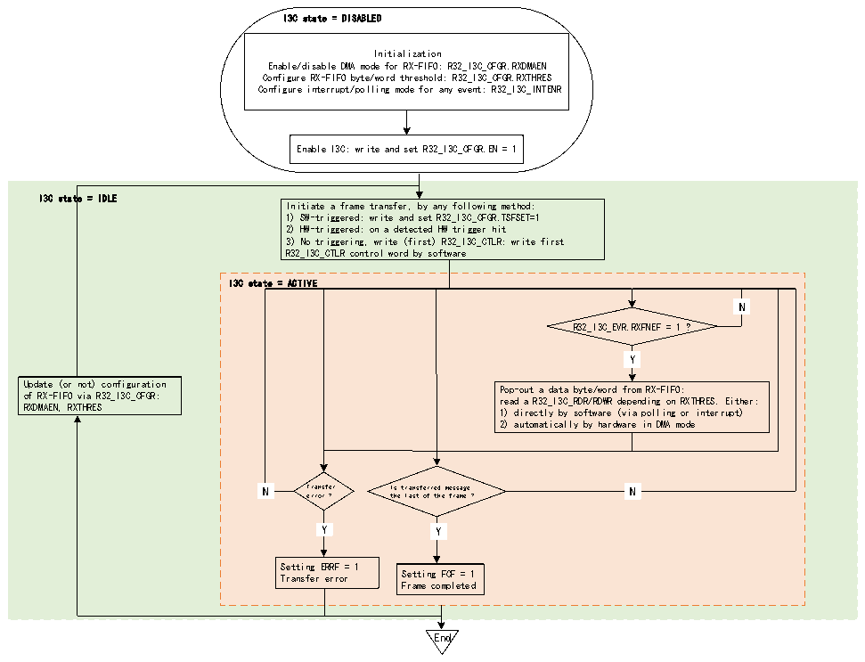

<!-- source-page: 414 -->

[← p.413](0413.md) · [index](../README.md) · [PDF p.414](https://ch32-riscv-ug.github.io/CH32H417/datasheet_en/CH32H417RM.PDF#page=414) · [p.415 →](0415.md)

<!-- header: CH32H417 Reference Manual https://wch-ic.com -->
–Wait for the second control word to be written into the C-FIFO, after which the C-FIFO becomes full.  
–If the TX-FIFO is not full, wait for data bytes/words to be written into the TX-FIFO (if any), as defined by the  
second control word (RNW=0 in the R32_I3C_CTLR register and DCNT[15:0]), up to the maximum size of the  
TX-FIFO.  
Then, whenever the hardware detects a requirement to transmit the next control word on the I3C bus (if a  
duplicate start bit must be sent on the I3C bus), it immediately requests that control word be written into the  
C-FIFO, continuing until the final message (MEND=1 in the R32_I3C_CTLR register).  
Similarly, whenever a hardware request is detected to send the next data byte/word on the I3C bus (if a repeat start  
bit must be issued on the I3C bus, the TX-FIFO is not full, or data bytes/words will be sent during that I3C  
message), that data byte/word must be written to the TX-FIFO immediately.  

#### 22.3.5.3 RX-FIFO Management (as master)

When used as a master device, RX-FIFO can be used during broadcasting ENTDAA CCC, direct CCC reading  
(including direct RSTACT CCC reading), private reading and traditional I2C reading.  
Figure 22-17 illustrates how to manage the RX-FIFO to queue and eject data bytes or words to be received on the  
I3C bus when the I3C peripheral is used as the master device.  

Figure 22-17 RX-FIFO management (as master)  
 <!-- rendered from the PDF; verify at https://ch32-riscv-ug.github.io/CH32H417/datasheet_en/CH32H417RM.PDF#page=414 -->

🖼 Text parsed from the figure above

I3C state = DISABLED  
Initialization  
Enable/disable DMA mode for RX-FIFO: R32_I3C_CFGR.RXDMAEN  
Configure RX-FIFO byte/word threshold: R32_I3C_CFGR.RXTHRES  
Configure interrupt/polling mode for any event: R32_I3C_INTENR  
Enable I3C: write and set R32_I3C_CFGR.EN = 1  
I3C state = IDLE  
Initiate a frame transfer, by any following method:  
1) SW-triggered: write and set R32_I3C_CFGR.TSFSET=1  
2) HW-triggered: on a detected HW trigger hit  
3) No triggering, write (first) R32_I3C_CTLR: write first  
R32_I3C_CTLR control word by software  
I3C state = ACTIVE  
N  N  
R32_I3C_EVR.RXFNEF = 1 ?  
Y  Y  
Update (or not) configuration Pop-out a data byte/word from RX-FIFO:  
of RX-FIFO via R32_I3C_CFGR: read a R32_I3C_RDR/RDWR depending on RXTHRES. Either:  
RXDMAEN, RXTHRES 1) directly by software (via polling or interrupt)  
2) automatically by hardware in DMA mode  
N  N  
N Transfer Is transferred message N  
error ? the last of the frame ?  
Y  Y  
Y  Y  
Y Y  
Setting ERRF = 1  
Transfer error Setting FCF = 1  
Frame completed  
End  

First, the software must initialize the RX-FIFO management through the following fields in the R32_I3C_CFGR  
register:  
<!-- image: p414-draw-image-00001 bbox=[511.44, 786.36, 530.88, 796.68] -->
<!-- footer: V1.7 412 -->
