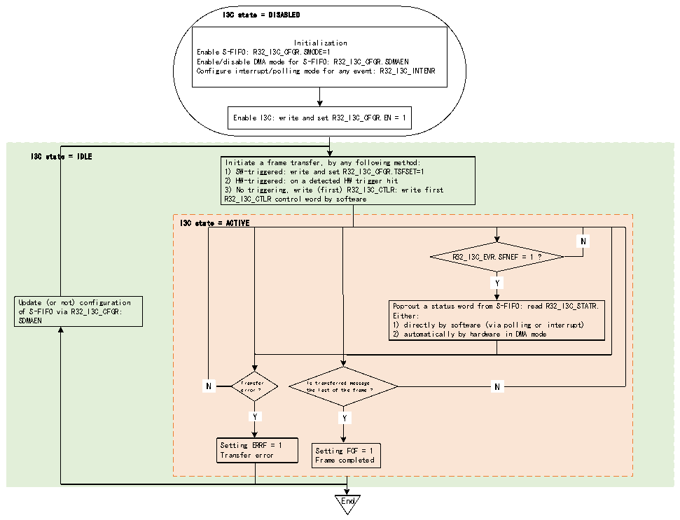

<!-- source-page: 417 -->

[← p.416](0416.md) · [index](../README.md) · [PDF p.417](https://ch32-riscv-ug.github.io/CH32H417/datasheet_en/CH32H417RM.PDF#page=417) · [p.418 →](0418.md)

<!-- header: CH32H417 Reference Manual https://wch-ic.com -->

Figure 22-18 S-FIFO management (as master)  
 <!-- rendered from the PDF; verify at https://ch32-riscv-ug.github.io/CH32H417/datasheet_en/CH32H417RM.PDF#page=417 -->

🖼 Text parsed from the figure above

I3C state = DISABLED  
Initialization  
Enable S-FIFO: R32_I3C_CFGR.SMODE=1  
Enable/disable DMA mode for S-FIFO: R32_I3C_CFGR.SDMAEN  
Configure interrupt/polling mode for any event: R32_I3C_INTENR  
Enable I3C: write and set R32_I3C_CFGR.EN = 1  
I3C state = IDLE  
Initiate a frame transfer, by any following method:  
1) SW-triggered: write and set R32_I3C_CFGR.TSFSET=1  
2) HW-triggered: on a detected HW trigger hit  
3) No triggering, write (first) R32_I3C_CTLR: write first  
R32_I3C_CTLR control word by software  
I3C state = ACTIVE  
N  N  
R32_I3C_EVR.SFNEF = 1 ?  
Y  Y  
Update (or not) configuration Pop-out a status word from S-FIFO: read R32_I3C_STATR.  
of S-FIFO via R32_I3C_CFGR: Either:  
SDMAEN 1) directly by software (via polling or interrupt)  
2) automatically by hardware in DMA mode  
N  N  
N Transfer Is transferred message N  
error ? the last of the frame ?  
Y  Y  
Y  Y  
Y Y  
Setting ERRF = 1  
Transfer error Setting FCF = 1  
Frame completed  
End  

First, the software must initialize the S-FIFO management through the SDMAEN bit field in R32_I3C_CFGR  
register (DMA mode of enabling/disabling S-FIFO). Then, read the S-FIFO according to the SDMAEN bit:  
● Read directly by software (if SDMAEN=0):  
–Through polling mode (SFNEIE=0 in R32_I3C_INTENR register): Wait for the hardware to request the next  
status word before explicitly reading I3C_STATR register (SFNEF=1 in R32_I3C_INTENR register).  
–Through enabled interrupt notification (SFNEIE=1)  
● Read by the assigned DMA channel (if SDMAEN=1) to enable the corresponding I3C peripheral DMA  
request (i3c_rs_dma):  
–According to the configuration at DMA module level, DMA will automatically pop up/read status words from  
R32_I3C_STATR register and write them into its memory slave buffer until the frame is completed (after the last  
message of the frame, a stop bit will be issued on I3C bus), except in case of transmission error.  
Every message status must be read, otherwise when the S-FIFO is full and the next message status must be written,  
the hardware will set the overflow error flag to 1 (ERRF=1 in the R32 _ I3c _ EVR register and COVR=1 in the  
R32 _ I3c _ STATR register). If the corresponding interrupt is enabled (ERRIE=1 in the R32_I3C_INTENR  
register), an interrupt is generated.  
Frame completion is reported only when the S-FIFO is empty (FCF=1 in R32_I3C_EVR register).  
When the I3C peripheral is not working, the configuration of S-FIFO management can be modified.  

#### 22.3.5.5 TX-FIFO Management (as slave)

<!-- image: p417-draw-image-00001 bbox=[511.44, 786.36, 530.88, 796.68] -->
<!-- footer: V1.7 415 -->
