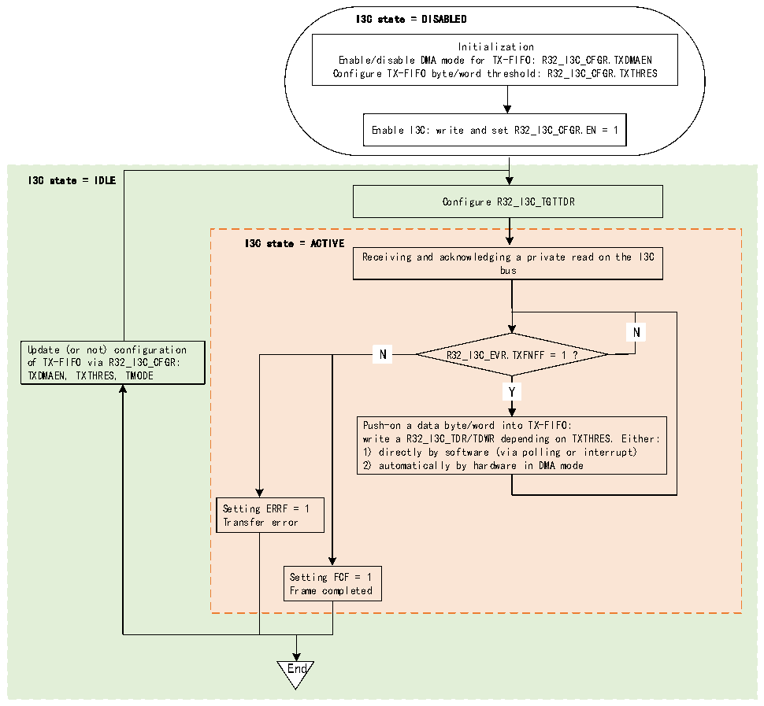

<!-- source-page: 418 -->

[← p.417](0417.md) · [index](../README.md) · [PDF p.418](https://ch32-riscv-ug.github.io/CH32H417/datasheet_en/CH32H417RM.PDF#page=418) · [p.419 →](0419.md)

<!-- header: CH32H417 Reference Manual https://wch-ic.com -->
When used as a slave device, the TX-FIFO can only be used during private read transmission.  
Figure 22-19 illustrates how to manage the TX-FIFO to queue and push data bytes or words to be sent on the I3C  
bus when the I3C peripheral is used as a slave device.  

Figure 22-19 TX-FIFO management (as slave)  
 <!-- rendered from the PDF; verify at https://ch32-riscv-ug.github.io/CH32H417/datasheet_en/CH32H417RM.PDF#page=418 -->

🖼 Text parsed from the figure above

I3C state = DISABLED  
Initialization  
Enable/disable DMA mode for TX-FIFO: R32_I3C_CFGR.TXDMAEN  
Configure TX-FIFO byte/word threshold: R32_I3C_CFGR.TXTHRES  
Enable I3C: write and set R32_I3C_CFGR.EN = 1  
I3C state = IDLE  
Configure R32_I3C_TGTTDR  
I3C state = ACTIVE  
Receiving and acknowledging a private read on the I3C  
bus  
N  N  
N  N  
Update (or not) configuration N R32_I3C_EVR.TXFNFF = 1 ?  
of TX-FIFO via R32_I3C_CFGR:  
TXDMAEN, TXTHRES, TMODE  
Y  Y  
Push-on a data byte/word into TX-FIFO:  
write a R32_I3C_TDR/TDWR depending on TXTHRES. Either:  
1) directly by software (via polling or interrupt)  
2) automatically by hardware in DMA mode  
Setting ERRF = 1  
Transfer error  
Setting FCF = 1  
Frame completed  
End  

First, the software must initialize the TX-FIFO management and write the following bits in R32_I3C_CFGR:  
● TXDMAEN: Enable/disable DMA mode for the TX-FIFO  
● TXTHRES: Push data bytes or words into the TX-FIFO  
Then, before receiving a private read transfer on the I3C bus, the software must configure the I3C slave device to  
send the configuration register (R32_I3C_TGTTDR) to preload a specified number of data bytes into the  
TX-FIFO (by writing TGTTDCNT[15:0] and setting PRELOAD=1 in a single access). This prepares the I3C bus  
to transmit data bytes from the slave device:  
● If PRELOAD=1 and TGTTDCNT[15:0] &gt; TX-FIFO size, the TX-FIFO will first preload up to the FIFO size.  
● If PRELOAD=1 and TGTTDCNT[15:0] ≤ TX-FIFO size, the TX-FIFO will preload to TGTTDCNT[15:0].  
Pre-load TX-FIFO according to TXDMAEN bit:  
● Preloading by byte/word directly by software (TXDMAEN=0):  
<!-- image: p418-draw-image-00001 bbox=[511.44, 786.36, 530.88, 796.68] -->
<!-- footer: V1.7 416 -->
