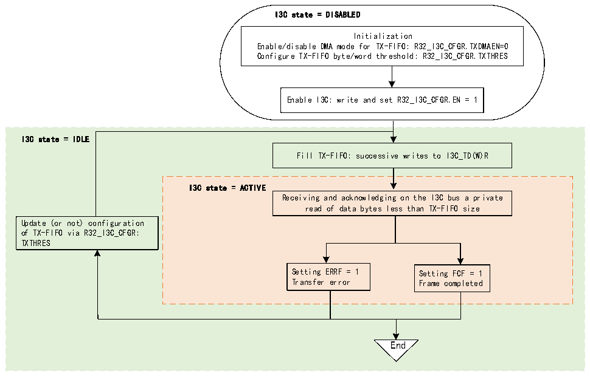

<!-- source-page: 420 -->

[← p.419](0419.md) · [index](../README.md) · [PDF p.420](https://ch32-riscv-ug.github.io/CH32H417/datasheet_en/CH32H417RM.PDF#page=420) · [p.421 →](0421.md)

<!-- header: CH32H417 Reference Manual https://wch-ic.com -->

Figure 22-20 If the number of bytes read is smaller than the size of the TX-FIFO, the TX-FIFO (as a slave device)  
 <!-- rendered from the PDF; verify at https://ch32-riscv-ug.github.io/CH32H417/datasheet_en/CH32H417RM.PDF#page=420 -->

is managed by software without using I3C_TGTTDR  

🖼 Text parsed from the figure above

I3C state = DISABLED  
Initialization  
Enable/disable DMA mode for TX-FIFO: R32_I3C_CFGR.TXDMAEN=0  
Configure TX-FIFO byte/word threshold: R32_I3C_CFGR.TXTHRES  
Enable I3C: write and set R32_I3C_CFGR.EN = 1  
I3C state = IDLE  
Fill TX-FIFO: successive writes to I3C_TD(W)R  
I3C state = ACTIVE  
Receiving and acknowledging on the I3C bus a private  
read of data bytes less than TX-FIFO size  
Update (or not) configuration  
of TX-FIFO via R32_I3C_CFGR:  
TXTHRES  
Setting ERRF = 1 Setting FCF = 1  
Transfer error Frame completed  
End  

#### 22.3.5.6 RX-FIFO Management (as slave)

When used as a slave device, the RX-FIFO can be used during the received and acknowledged transmission of  
broadcast DEFTGTS CCC, broadcast DEFGRPA CCC and private writing:  
Figure 22-21 illustrates how to manage the RX-FIFO to queue and eject data bytes/words received from the I3C  
bus when the I3C peripheral is used as a slave device.  
<!-- image: p420-draw-image-00001 bbox=[511.44, 786.36, 530.88, 796.68] -->
<!-- footer: V1.7 418 -->
