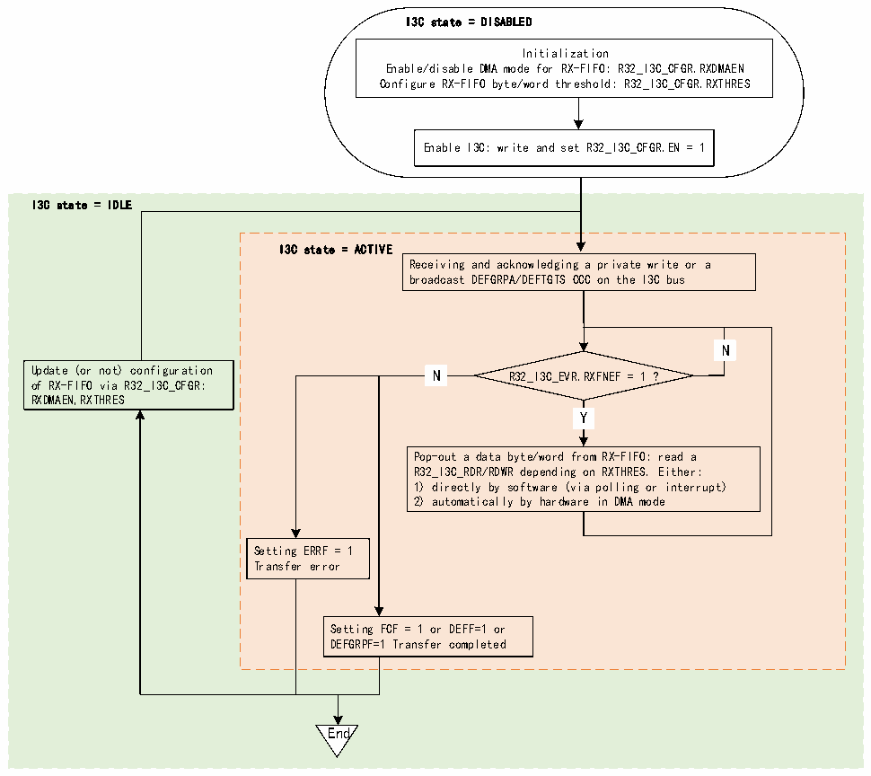

<!-- source-page: 421 -->

[← p.420](0420.md) · [index](../README.md) · [PDF p.421](https://ch32-riscv-ug.github.io/CH32H417/datasheet_en/CH32H417RM.PDF#page=421) · [p.422 →](0422.md)

<!-- header: CH32H417 Reference Manual https://wch-ic.com -->

Figure 22-21 RX-FIFO management (as slave)  
 <!-- rendered from the PDF; verify at https://ch32-riscv-ug.github.io/CH32H417/datasheet_en/CH32H417RM.PDF#page=421 -->

🖼 Text parsed from the figure above

I3C state = DISABLED  
Initialization  
Enable/disable DMA mode for RX-FIFO: R32_I3C_CFGR.RXDMAEN  
Configure RX-FIFO byte/word threshold: R32_I3C_CFGR.RXTHRES  
Enable I3C: write and set R32_I3C_CFGR.EN = 1  
I3C state = IDLE  
I3C state = ACTIVE  
Receiving and acknowledging a private write or a  
broadcast DEFGRPA/DEFTGTS CCC on the I3C bus  
N  N  
N  N  
Update (or not) configuration N R32_I3C_EVR.RXFNEF = 1 ?  
of RX-FIFO via R32_I3C_CFGR:  
RXDMAEN,RXTHRES  
Y  Y  
Pop-out a data byte/word from RX-FIFO: read a  
R32_I3C_RDR/RDWR depending on RXTHRES. Either:  
1) directly by software (via polling or interrupt)  
2) automatically by hardware in DMA mode  
Setting ERRF = 1  
Transfer error  
Setting FCF = 1 or DEFF=1 or  
DEFGRPF=1 Transfer completed  
End  

First, the software must initialize the RX-FIFO management through the following R32_I3C_CFGR register bit  
fields:  
● RXDMAEN: Enable/disable DMA mode for the RX-FIFO;  
● RXTHRES: Pop data bytes or words from the RX-FIFO;  
Then, read the RX-FIFO based on the RXDMAEN bit:  
● Read directly by software in bytes/words (if RXDMAEN=0):  
– Through polling mode (RXFNEIE=0 in the R32_I3C_INTENR register): Wait for the hardware to request the  
next data byte/word (RXFNEF=1 in the R32_I3C_INTENR register) before explicitly reading the R32_I3C_RDR  
or R32_I3C_RDWR register. Whether it is a byte or a word depends on RXTHRES in the R32_I3C_CGFR  
register.  
– Via enabled interrupt notification (if RXFNEIE=1)  
● Read by the assigned DMA channel (if RXDMAEN=1) to enable the corresponding I3C peripheral DMA  
request (I3C_RX_DMA):  
– Based on the configuration at the DMA module level, the DMA automatically pops/reads data bytes/words  
from the R32_I3C_RDR or R32_I3C_RDWR register (depending on RXTHRES) and writes them into its  
memory slave device buffer until the transfer completes (when FCF=1 in the R32_I3C_EVR register (private  
write), GRPF=1 (DEFGRPA CCC), or DEFF=1 (DEFTGTS CCC)), except when a transfer error occurs.  
<!-- image: p421-draw-image-00001 bbox=[511.44, 786.36, 530.88, 796.68] -->
<!-- footer: V1.7 419 -->
