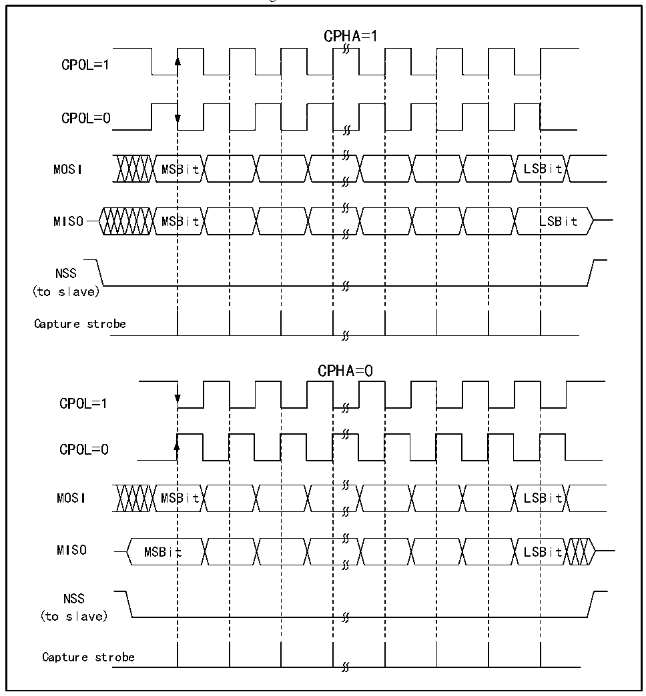

<!-- source-page: 467 -->

[← p.466](0466.md) · [index](../README.md) · [PDF p.467](https://ch32-riscv-ug.github.io/CH32H417/datasheet_en/CH32H417RM.PDF#page=467) · [p.468 →](0468.md)

<!-- header: CH32H417 Reference Manual https://wch-ic.com -->
the SPI module samples on the first edge of the clock, and the data is latched. CPOL indicates whether the clock  
remains high or low when there is no data. See Figure 23-2 below for details.  

Figure 23-2 SPI model  
 <!-- rendered from the PDF; verify at https://ch32-riscv-ug.github.io/CH32H417/datasheet_en/CH32H417RM.PDF#page=467 -->

🖼 Text parsed from the figure above

CPHA=1  
CPOL=1  
CPOL=0  
MOSI MSBit LSBit  
MISO MSBit LSBit  
NSS  
(to slave)  
Capture strobe  
CPHA=0  
CPOL=1  
CPOL=0  
MOSI MSBit LSBit  
MISO MSBit LSBit  
NSS  
(to slave)  
Capture strobe  

The host and device need to be set to the same SPI mode, and the SPE bit needs to be cleared before configuring  
the SPI mode. The DEF bit can decide whether the single data length of SP is 8 bits or 16 bits. LSBFIRST can  
control whether a single data word is big-endian or little-endian.  

### 23.2.2 Master Mode

When the SPI module works in master mode, the serial clock is generated by SCK. To configure into master mode  
do the following steps:  
Configure the BR[2:0] bits in the control register to determine the clock;  
<!-- image: p467-draw-image-00001 bbox=[511.44, 786.36, 530.88, 796.68] -->
<!-- footer: V1.7 465 -->
