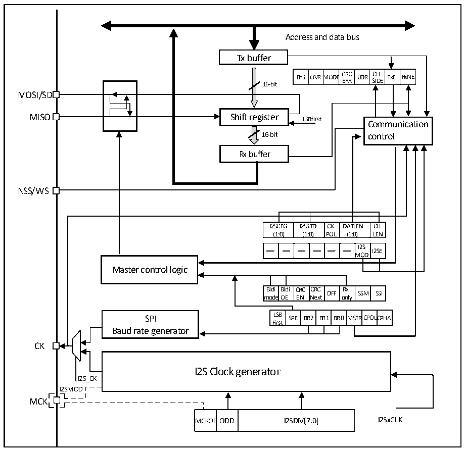

<!-- source-page: 470 -->

[← p.469](0469.md) · [index](../README.md) · [PDF p.470](https://ch32-riscv-ug.github.io/CH32H417/datasheet_en/CH32H417RM.PDF#page=470) · [p.471 →](0471.md)

<!-- header: CH32H417 Reference Manual https://wch-ic.com -->

## 23.3 I2S Functional Description

### 23.3.1 I2S Overview

Figure 23-3 I2S structure diagram  
 <!-- rendered from the PDF; verify at https://ch32-riscv-ug.github.io/CH32H417/datasheet_en/CH32H417RM.PDF#page=470 -->

🖼 Text parsed from the figure above

Address and data bus  
Tx buffer  
BYS  OVRM  MODF  FCRCERR  UDR  CHSIDE  TxE  RxNE  
16-bit  
MOSI/SD  
MISO Shift register LSB first  
Communication  
16-bit control  
Rx buffer  
NSS/WS  
I2SCFG (1:0)  I2SSTD (1:0)  CKPOL  DATLEN (1:0)  CHLEN  
I2SMOD  I2SE  
OD  
Master control logic  
Bidi mode  Bidi OE  CRCEN  CRCNext  DFF  Rx only  SSM  SSI  
LSBFirst  SPE  BR2  BR1  BR0  MSTR  CPOLC  CPHA  
SPI LSB SPE BR2 BR1 BR0MSTRCPOLCPHA  
Baud rate generator  
CK  
I2S Clock generator  
I2S_CK  
I2SMOD  
MCK  
MCKOE  ODD  I2SDIV[7:0]  

The I2S function is enabled by setting the I2SMOD bit in register I2SCFGR. At this point, the SPI module can be  
used as an I2S audio interface. I2S and SPI share 3 pins:  
- SD: Serial data (Mapped to MOSI pin), used to send and receive 2 time-multiplexed data channels;
- WS: word selection (Mapped to NSS pin), output as data control signal in master mode, and input in slave mode;
- CK: Serial clock (Mapped to the SCK pin), output as a clock signal in master mode, and input in slave mode.
When the main clock is required for some external audio devices, there is an additional pin to output the clock:  
- MCK: main clock (Independent mapping), when the I2S is configured as the main mode and the MCKOE bit of
the register I2SPR is 1, it is used as an output additional clock signal pin. The frequency of the output clock signal  
is preset to 256×Fs, where Fs is the sampling frequency of the audio signal.  
When set to master mode, I2S uses its own clock generator to generate the clock signal for communication. This  
clock generator is also the clock source for the master clock output. There are 2 additional registers in I2S mode,  
<!-- image: p470-draw-image-00001 bbox=[511.44, 786.36, 530.88, 796.68] -->
<!-- footer: V1.7 468 -->
