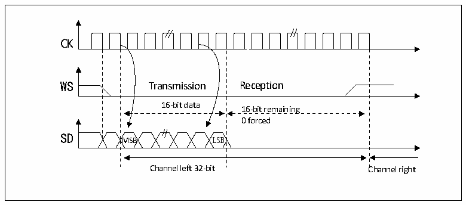

<!-- source-page: 473 -->

[← p.472](0472.md) · [index](../README.md) · [PDF p.473](https://ch32-riscv-ug.github.io/CH32H417/datasheet_en/CH32H417RM.PDF#page=473) · [p.474 →](0474.md)

<!-- header: CH32H417 Reference Manual https://wch-ic.com -->
First read from Data register Second read from Data register  
0x8EAA 0x3300  
Only the 8MSB are right  
The 8 LSB will always be 00  

Figure 23-6 Philips protocol standard waveforms (16-bit extended to 32-bit packet frame, CPOL=0)  
 <!-- rendered from the PDF; verify at https://ch32-riscv-ug.github.io/CH32H417/datasheet_en/CH32H417RM.PDF#page=473 -->

🖼 Text parsed from the figure above

Transmission  Reception  16-bit data MSB LSB  16-bit remaining 0 forced  
CK  
SD  
Channel left 32-bit Channel right  

In the I2S configuration stage, if you choose to extend the 16-bit data to a 32-bit channel frame, you only need to  
access the register DATAR once to extend to 32-bit. The lower 16 bits are set to 0x0000 by hardware. If the data  
to be transmitted or received is 0x76A3 (Extended to 32 bits is 0x76A30000), only one operation of DATAR is  
required. When sending, the MSB needs to be written into the register DATAR; if the flag bit TXE is 1, it means  
that new data can be written, and if the corresponding interrupt is allowed, an interrupt can be generated. The  
transmission is done by hardware, even if the last 16 bits of 0x0000 have not been sent, the TXE will be set and  
the corresponding interrupt will be generated. When receiving, each time the upper 16-bit half-word (MSB) is  
received, the flag bit RXNE is set to 1, and if the corresponding interrupt is enabled, an interrupt can be generated.  
This way, there is more time between the 2 reads and writes, preventing underflow or overflow conditions.  

#### 23.3.2.2 MSB alignment standard

Under this standard, the WS signal and the first data bit, the most significant bit (MSB), are generated  
simultaneously.  
<!-- image: p473-draw-image-00001 bbox=[511.44, 786.36, 530.88, 796.68] -->
<!-- footer: V1.7 471 -->
