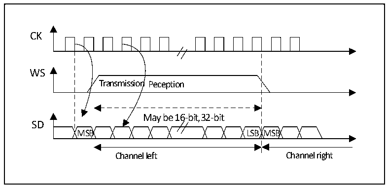
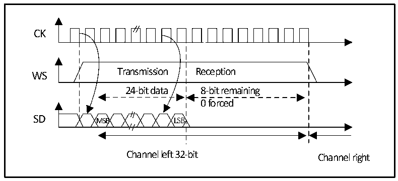
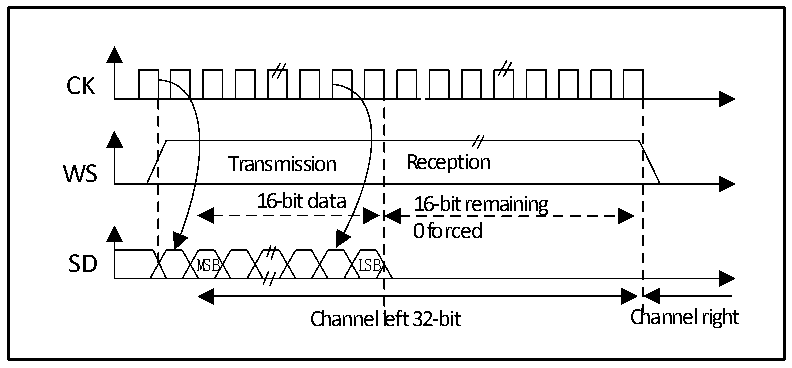

<!-- source-page: 474 -->

[← p.473](0473.md) · [index](../README.md) · [PDF p.474](https://ch32-riscv-ug.github.io/CH32H417/datasheet_en/CH32H417RM.PDF#page=474) · [p.475 →](0475.md)

<!-- header: CH32H417 Reference Manual https://wch-ic.com -->

Figure 23-7 MSB aligned 16-bit or 32-bit full precision (CPOL = 0)  
 <!-- rendered from the PDF; verify at https://ch32-riscv-ug.github.io/CH32H417/datasheet_en/CH32H417RM.PDF#page=474 -->

🖼 Text parsed from the figure above

CK  
Transmission Peception  
WS  
May be 16-bit,32-bit  
SD  
MSB LSB MSB  
Channel left Channel right  

The sender changes data on the falling edge of the clock signal; the receiver reads data on the rising edge.  

Figure 23-8 MSB aligned 24-bit data, CPOL = 0  
 <!-- rendered from the PDF; verify at https://ch32-riscv-ug.github.io/CH32H417/datasheet_en/CH32H417RM.PDF#page=474 -->

🖼 Text parsed from the figure above

CK  
Transmission Reception  
WS  
24-bit data 8-bit remaining  
0 forced  
SD MSB LSB  
Channel left 32-bit Channel right  

Figure 23-9 MSB-aligned 16-bit data extended to 32-bit packet frame, CPOL = 0  
 <!-- rendered from the PDF; verify at https://ch32-riscv-ug.github.io/CH32H417/datasheet_en/CH32H417RM.PDF#page=474 -->

🖼 Text parsed from the figure above

CK  
Transmission Reception  
WS  
16-bit data 16-bit remaining  
0 forced  
SD MSB LSB  
Channel left 32-bit Channel right  

#### 23.3.2.3 LSB alignment standard

<!-- image: p474-draw-image-00001 bbox=[511.44, 786.36, 530.88, 796.68] -->
<!-- footer: V1.7 472 -->
