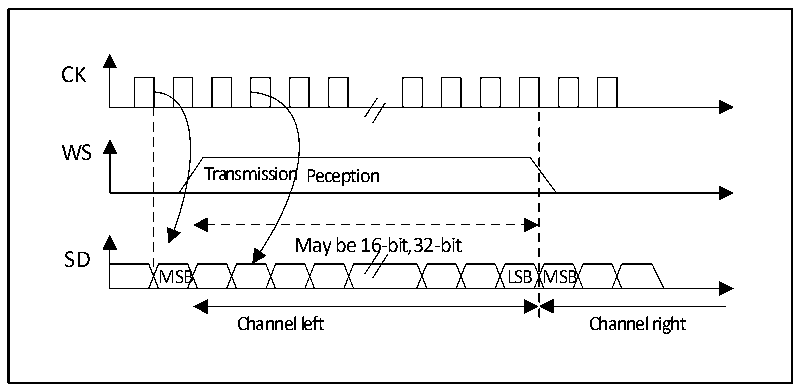
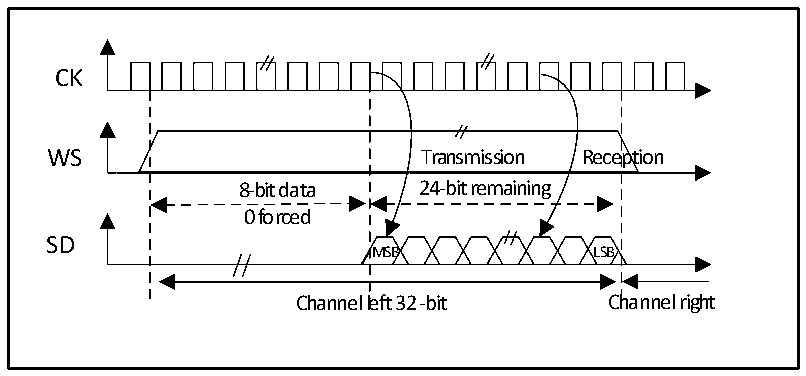

<!-- source-page: 475 -->

[← p.474](0474.md) · [index](../README.md) · [PDF p.475](https://ch32-riscv-ug.github.io/CH32H417/datasheet_en/CH32H417RM.PDF#page=475) · [p.476 →](0476.md)

<!-- header: CH32H417 Reference Manual https://wch-ic.com -->
This standard is similar to the MSB alignment standard (No difference in 16-bit or 32-bit full-precision frame  
format).  

Figure 23-10 LSB-aligned 16- or 32-bit full precision, CPOL = 0  
 <!-- rendered from the PDF; verify at https://ch32-riscv-ug.github.io/CH32H417/datasheet_en/CH32H417RM.PDF#page=475 -->

🖼 Text parsed from the figure above

CK  
WS  
Transmission Peception  
May be 16-bit,32-bit  
SD  
MSB LSB MSB  
Channel left Channel right  

Figure 23-11 LSB-aligned 24-bit data, CPOL = 0  
 <!-- rendered from the PDF; verify at https://ch32-riscv-ug.github.io/CH32H417/datasheet_en/CH32H417RM.PDF#page=475 -->

🖼 Text parsed from the figure above

CK  
WS Transmission Reception  
8-bit data 24-bit remaining  
0 forced  
SD  
MSB LSB  
Channel left 32 -bit Channel right  

In transmit mode, if you want to send data 0x3478AE, you need to write the register DATAR twice by software or  
DMA.  
TEX=&#x27;1 &#x27; when the data register is written TEX=&#x27;1 &#x27; when the data register is written  
for the first time for the second time  
0xXX34 0x78E  
Only the lower 8 bits in the halfword have meaning, the higher 8 bits are forced to  
be set to 0x00  
In receive mode, if you want to receive data 0x3478AE, you need to read the register DATAR once when 2  
consecutive RXNE events occur.  
<!-- image: p475-draw-image-00001 bbox=[511.44, 786.36, 530.88, 796.68] -->
<!-- footer: V1.7 473 -->
