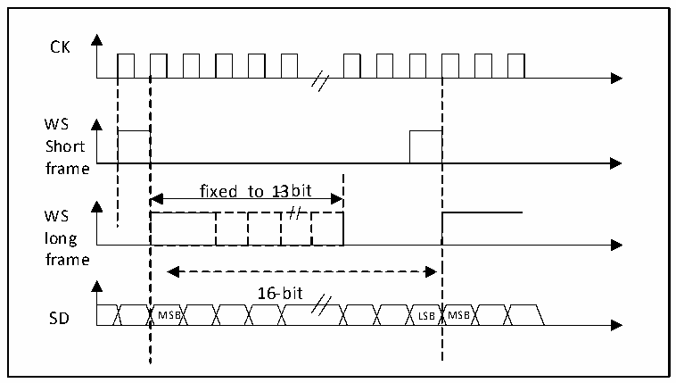
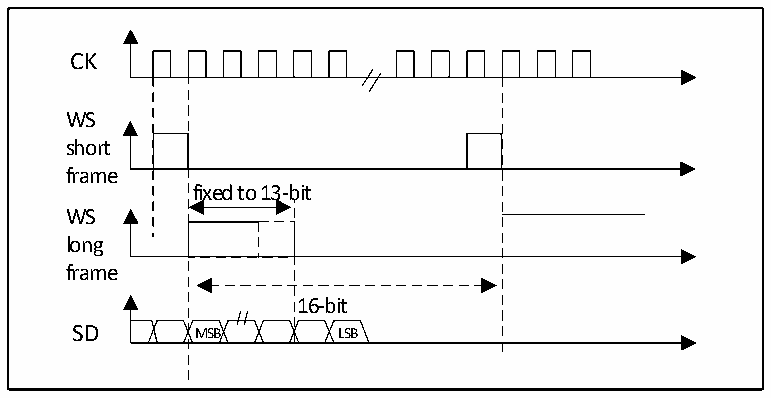

<!-- source-page: 477 -->

[← p.476](0476.md) · [index](../README.md) · [PDF p.477](https://ch32-riscv-ug.github.io/CH32H417/datasheet_en/CH32H417RM.PDF#page=477) · [p.478 →](0478.md)

<!-- header: CH32H417 Reference Manual https://wch-ic.com -->

Figure 23-13 PCM standard waveform (16-bit)  
 <!-- rendered from the PDF; verify at https://ch32-riscv-ug.github.io/CH32H417/datasheet_en/CH32H417RM.PDF#page=477 -->

🖼 Text parsed from the figure above

CK  
fixed to 1-3bit  16-bit MSB LSB  
WS  
Short  
frame  
WS  
long  
frame  

For the long frame, in the main mode, the valid time of the WS signal used for synchronization is fixed to 13 bits.  
For short frames, the length of the WS signal used for synchronization is only 1 bit.  

Figure 23-14 PCM standard waveform (16-bit)  
 <!-- rendered from the PDF; verify at https://ch32-riscv-ug.github.io/CH32H417/datasheet_en/CH32H417RM.PDF#page=477 -->

🖼 Text parsed from the figure above

CK  
WS  
short  
frame  
fixed to 13-bit  
WS  
long  
frame  
16-bit  
SD MSB LSB  

No matter which mode (Master or slave), which synchronization method (Short frame or long frame), the time  
difference between 2 consecutive frames of data and between 2 synchronization signals, (Even in slave mode)  
needs to be set by setting the I2SCFGR register determined by the DATLEN bit and the CHLEN bit.  

### 23.3.3 Clock Generator

The bit rate of I2S determines the data flow on the I2S data line and the frequency of the I2S clock signal. I2S bit  
rate = number of bits per channel × number of channels × audio sampling frequency.  
For a signal with left and right channels and 16-bit audio, the I2S bit rate is calculated as follows:  
I2S bit rate = 16 × 2 × Fs  
If the packet length is 32 bits, the I2S bit rate is calculated as follows:  
I2S bit rate = 32 × 2 × Fs  
<!-- image: p477-draw-image-00001 bbox=[511.44, 786.36, 530.88, 796.68] -->
<!-- footer: V1.7 475 -->
