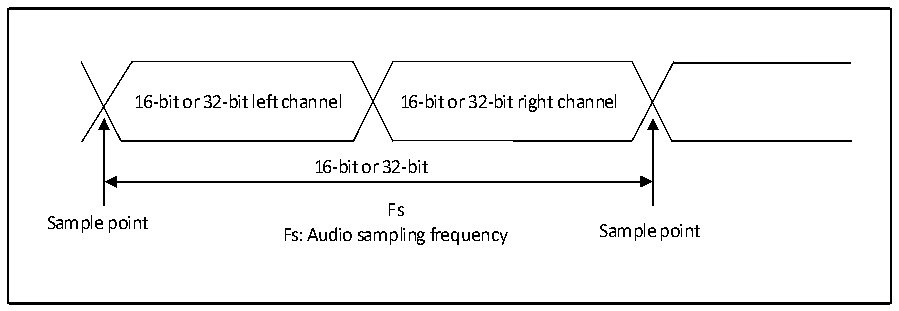
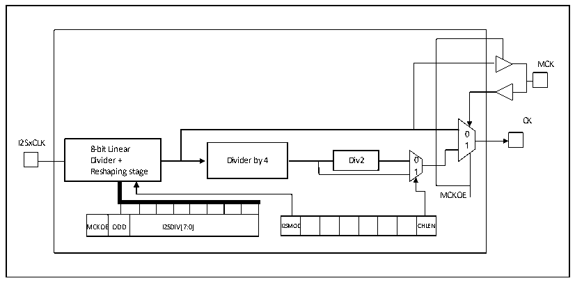

<!-- source-page: 478 -->

[← p.477](0477.md) · [index](../README.md) · [PDF p.478](https://ch32-riscv-ug.github.io/CH32H417/datasheet_en/CH32H417RM.PDF#page=478) · [p.479 →](0479.md)

<!-- header: CH32H417 Reference Manual https://wch-ic.com -->

Figure 23-15 Audio sampling frequency definition  
 <!-- rendered from the PDF; verify at https://ch32-riscv-ug.github.io/CH32H417/datasheet_en/CH32H417RM.PDF#page=478 -->

🖼 Text parsed from the figure above

16-bit or 32-bit left channel 16-bit or 32-bit right channel  
16-bit or 32-bit  
Fs  
Sample point  
Fs: Audio sampling frequency Sample point  

In master mode, the linear divider needs to be set correctly in order to obtain the desired audio frequency.  

Figure 23-16 I2S clock generator structure  
 <!-- rendered from the PDF; verify at https://ch32-riscv-ug.github.io/CH32H417/datasheet_en/CH32H417RM.PDF#page=478 -->

🖼 Text parsed from the figure above

MCK  
CK  
0  
I2SxCLK 8-bit Linear 1  
Divider + Dividecr by 4 Dicv2 0  
Reshaping stage 1  
MCKOE  
MCKOE  EODD  I2SDIV[7:0]  
I2SMOD  D  C  CHLEN  
MCKOEODD I2SDIV[7:0] I2SMOD CHLEN  

The clock source of I2SxCLK in the figure is the system clock (i.e., the HSI, HSE, or PLL that drives the HB  
clock). I2SxCLK can come from SYSCLK, or the PLL3 VCO (2xPLL3CLK) clock, which can be selected by the  
I2S2SRC and I2S3SRC bits in the RCC_CFGR2 register. Audio can be sampled at 96kHz, 48kHz, 44.1kHz,  
32kHz, 22.05kHz, 16kHz, 11.025kHz, or 8kHz (Or any value within this range). To obtain the desired frequency,  
set the linear divider according to the following formula:  
When the master clock needs to be generated (The MCKOE bit of the register SPI_I2SPR is 1):  
When the frame length of the channel is 16 bits, Fs = I2SxCLK / [(16*2) * ((2*I2SDIV) + ODD)*8]  
When the frame length of the channel is 32 bits, Fs = I2SxCLK / [(32*2) * ((2*I2SDIV) + ODD)*4]  
When the main clock is turned off (MCKOE bit is &#x27;0&#x27;):  
When the frame length of the channel is 16 bits, Fs = I2SxCLK / [(16*2) * ((2*I2SDIV) + ODD)]  
When the frame length of the channel is 32 bits, Fs = I2SxCLK / [(32*2) * ((2*I2SDIV) + ODD)]  

### 23.3.4 I2S Master Mode

Set I2S to work in master mode, the serial clock is output by pin CK, and the word selection signal is generated by  
pin WS. The master clock (MCK) can be selected to be output or not output by setting the MCKOE bit in register  
I2SPR.  
<!-- image: p478-draw-image-00001 bbox=[511.44, 786.36, 530.88, 796.68] -->
<!-- footer: V1.7 476 -->
