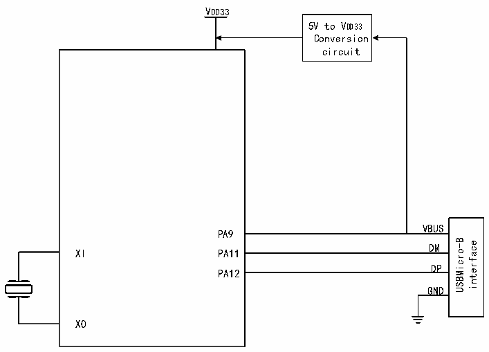

<!-- source-page: 528 -->

[← p.527](0527.md) · [index](../README.md) · [PDF p.528](https://ch32-riscv-ug.github.io/CH32H417/datasheet_en/CH32H417RM.PDF#page=528) · [p.529 →](0529.md)

<!-- header: CH32H417 Reference Manual https://wch-ic.com -->
R16_UEPn_T_LEN, which are used to configure the endpoint&#x27;s synchronous trigger bit, response to OUT  
and IN transactions, and the length of transmitted data.  
The host and device roles of the USB OTG module are determined by the state of the OTG_FS_ID pin. When the  
OTG_FS_ID pin is left floating, its internal pull-up resistor sets the RB_SR_ID_DIG bit to 1 in the USB OTG  
status register R32_USB_OTG_SR. At this point, the controller should initialize as a B device. When the  
OTG_FS_ID pin is grounded, the RB_SR_ID_DIG bit in the USB OTG status register R32_USB_OTG_SR is set  
to 0. The controller should initialize as a B device.  
Device B ensures the VBUS level remains below VSESS_VLD.min during session initiation based on the  
RB_SR_SESS_VLD bit in the OTG status register R32_USB_OTG_SR. If this bit is 0, a new session may  
commence. If this bit is 0, a new session may commence. If this bit is set to 1, the device discharges the VBUS  
line by setting the RB_CR_DISCHAR_VBUS bit in the OTG control register R32_USB_OTG_CR to 1, thereby  
reducing VBUS below the session threshold voltage.  
As a class B device, if it needs to get power from VBUS, it needs a conversion circuit externally, as shown in  
Figure 26-1.  

Figure 26-1 Connection Diagram of OTG Class B Equipment  
 <!-- rendered from the PDF; verify at https://ch32-riscv-ug.github.io/CH32H417/datasheet_en/CH32H417RM.PDF#page=528 -->

🖼 Text parsed from the figure above

VDD33  
5V to VDD33  
Conversion  
circuit  
VBUS  
PA9  
VBUSDM  DMDP  
USBMicro-B interface  
XI  
PA11  
PA12  
GND  
XO  

The USB bus pull-up resistor necessary for the USB device can be set by the software at any time. When the  
RB_UC_DEV_PU_EN in the USB control register R8_USB_CTRL is set to 1, the controller connects the pull-up  
resistor for the DP/DM pin of the USB bus internally according to the speed setting of the  
RB_UC_SPEED_TYPE, and enables the USB device function.  
When a USB bus reset, a USB bus hang or wake-up event is detected, or when the USB successfully processes  
data transmission or data reception, the USB protocol processor will set the corresponding interrupt flag, and if  
the interrupt is enabled, a corresponding interrupt request will be generated. The application program can query  
directly or query and analyze the interrupt flag register R8_USB_INT_FG in the USB interrupt service program,  
and deal with it according to RB_UIF_BUS_RST and RB_UIF_SUSPEND. And, if the RB_UIF_TRANSFER is  
valid, then you need to continue to analyze the USB interrupt status register R8_USB_INT_ST and process it  
accordingly according to the current endpoint number MASK_UIS_ENDP and the current transaction token PID  
identification MASK_UIS_TOKEN. If the synchronization trigger bit RB_UEP_R_TOG of the OUT transaction  
<!-- image: p528-draw-image-00001 bbox=[511.44, 786.36, 530.88, 796.68] -->
<!-- footer: V1.7 526 -->
