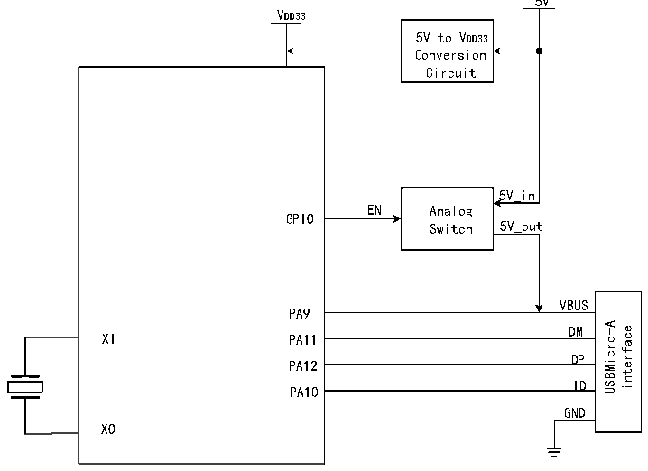

<!-- source-page: 535 -->

[← p.534](0534.md) · [index](../README.md) · [PDF p.535](https://ch32-riscv-ug.github.io/CH32H417/datasheet_en/CH32H417RM.PDF#page=535) · [p.536 →](0536.md)

<!-- header: CH32H417 Reference Manual https://wch-ic.com -->

> ⬆ **Table continued** — rendered in full at [page 534](0534.md). <!-- p535-table-001 -->

<em>Note 1. Endpoint configuration supports endpoints 0-7, which can be mapped to configure transmission for</em>  
<em>endpoints 8-15.</em>  

### 26.2.3 USB Host Register

In USB host mode, the chip provides a set of bi-directional host endpoints, including a sending endpoint OUT and  
a receiving endpoint IN. The maximum length of a packet is 1023 bytes (synchronous transmission), supporting  
control transmission, interrupt transmission, lot transmission and real-time/synchronous transmission.  
In USB OTG host mode, if the controller cannot provide 5V power to VUBS, an external charge pump must be  
used. If the application board can supply 5V power, an analog switch can be employed to control the enable and  
disable of VBUS, as shown in Figure 26-2.  

Figure 26-2 OTG class A device connection  
 <!-- rendered from the PDF; verify at https://ch32-riscv-ug.github.io/CH32H417/datasheet_en/CH32H417RM.PDF#page=535 -->

🖼 Text parsed from the figure above

5V  
VDD33  
5V to VDD33  
Conversion  
Circuit  
5V_in  
EN Analog  
GPIO  
Switch 5V_out  
VBUS  
PA9  
VBUSDM  DMDP  DPID  
USBMicro-A interface  
XI  
PA11  
PA12  
PA10  
GND  
XO  

Every USB transaction initiated by the host endpoint automatically sets the RB_UIF_TRANSFER interrupt flag at  
the end of the processing. The application program can directly query or query and analyze the interrupt flag  
register R8_USB_INT_FG in the USB interrupt service program, and carry out corresponding processing  
according to each interrupt flag; moreover, if the RB_UIF_TRANSFER is valid, then it is necessary to continue to  
analyze the USB interrupt status register R8_USB_INT_ST and carry out corresponding processing according to  
the reply PID identification MASK_UIS_H_RES of the current USB transmission transaction.  
If the synchronization trigger bit (RB_UH_R_TOG) of the IN transaction of the host receiving endpoint is set in  
advance, then whether the synchronization trigger bit of the currently received data packet matches the  
synchronization trigger bit of the host receiving endpoint can be determined by RB_U_TOG_OK or  
RB_UIS_TOG_OK. If the data is synchronized, the data is valid; if the data is not synchronized, the data should  
be discarded. After each interrupt of USB transmission or reception, the synchronization trigger bit of the  
corresponding host endpoint should be correctly modified to synchronize the next sent data packet and detect  
whether the next received data packet is synchronized; in addition, by setting RB_UH_T_AUTO_TOG and  
<!-- image: p535-draw-image-00001 bbox=[511.44, 786.36, 530.88, 796.68] -->
<!-- footer: V1.7 533 -->
