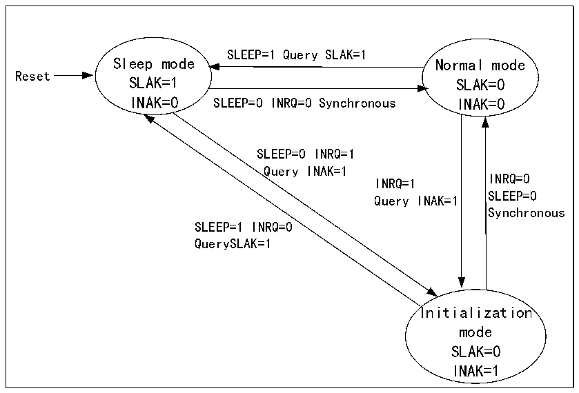

<!-- source-page: 589 -->

[← p.588](0588.md) · [index](../README.md) · [PDF p.589](https://ch32-riscv-ug.github.io/CH32H417/datasheet_en/CH32H417RM.PDF#page=589) · [p.590 →](0590.md)

<!-- header: CH32H417 Reference Manual https://wch-ic.com -->
From sleep mode to initialization mode, the SLEEP bit of CANx_CTLR must be cleared to position 1, and when  
the INAK bit of register CANx_STATR is automatically set to 1, it will be switched to initialization state.  
To enter the normal mode from sleep mode, the SLEEP bit of CANx_CTLR must be cleared 0, and when the  
SNAK bit of register CANx_STATR is automatically cleared 0, it will enter normal mode.  

Figure 28-1 CAN operating mode switch  
 <!-- rendered from the PDF; verify at https://ch32-riscv-ug.github.io/CH32H417/datasheet_en/CH32H417RM.PDF#page=589 -->

🖼 Text parsed from the figure above

SLEEP=1 Query SLAK=1  
Sleep mode Normal mode  
Reset  
SLAK=1 SLAK=0  
INAK=0 SLEEP=0 INRQ=0 Synchronous INAK=0  
SLEEP=0 INRQ=1  
Query INAK=1  
INRQ=0  
INRQ=1  
SLEEP=0  
Query INAK=1  
Synchronous  
SLEEP=1 INRQ=0  
QuerySLAK=1  
Initialization  
mode  
SLAK=0  
INAK=1  

## 28.3 CAN Controller Test Mode

In the initialization mode, operate the SILM and LBKM bits of the register CANx_BTIMR to select a test mode,  
and then exit the initialization mode and enter the test mode by clearing the INRQ bit of the register CANx_CTLR.  
There are 3 test modes: silent mode, loopback mode and silent loopback mode.  

### 28.3.1 Silent Mode

Setting the SILM bit in register CANx_BTIMR to 1 can optionally enter silent mode. In this mode, the CAN  
controller can receive, but cannot send messages to the outside world. It is always in a recessive bit to the outside  
world, which can avoid affecting the bus, but the message can be received by the controller of the node where it is  
located. Usually, silent mode is used for the status analysis of the CAN bus.  

### 28.3.2 Loopback Mode

By setting the LBKM bit of the register CANx_BTIMR to 1, the loopback mode can be selected. In this mode, the  
CAN controller can send external messages, but cannot receive external messages, but the sent messages can be  
received by the controller of the node where it is located, and the reception filtering mechanism is effective.  
Usually, loopback mode is used for transceiver testing of CAN controllers.  
<!-- image: p589-draw-image-00001 bbox=[511.44, 786.36, 530.88, 796.68] -->
<!-- footer: V1.7 587 -->
