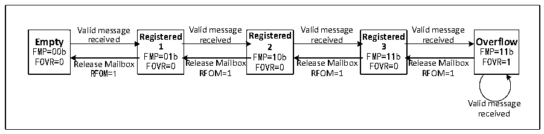

<!-- source-page: 592 -->

[← p.591](0591.md) · [index](../README.md) · [PDF p.592](https://ch32-riscv-ug.github.io/CH32H417/datasheet_en/CH32H417RM.PDF#page=592) · [p.593 →](0593.md)

<!-- header: CH32H417 Reference Manual https://wch-ic.com -->
then the state returns to registered 1; if the mailbox is not released in the registered 2 state, the receiving FIFO  
enters the registered 3 state; also in the registered 3 state, the message is read and the mailbox is released, then the  
registered 2 state is returned; if the registered 3 state is not If the mailbox is released, when the next valid packet is  
received, packet loss will inevitably occur.  

Figure 28-3 Receive FIFO state switching diagram  
 <!-- rendered from the PDF; verify at https://ch32-riscv-ug.github.io/CH32H417/datasheet_en/CH32H417RM.PDF#page=592 -->

🖼 Text parsed from the figure above

Valid message Valid message Valid message Valid message  
Empty received Registered received Registered received Registered received Overflow  
FMP=00b 1 2 3 FMP=11b  
FMP=01b FMP=10b FMP=11b  
FOVR=0 Release Mailbox FOVR=0 Release Mailbox FOVR=0 Release Mailbox FOVR=0 Release Mailbox FOVR=1  
RFOM=1 RFOM=1 RFOM=1 RFOM=1  
Valid message  
received  

In the case of message loss above, that is, the receiving FIFO is full, and the message overflow causes the  
message to be lost. The FOVR bit of the receiving FIFO register CANx_RFIFOx will be automatically set to 1 by  
hardware for overflow query. When the RFLM bit of the register CANx_CTLR is set to 1, the receiving FIFO  
locking function is enabled, and the discarded message is a new received message; when the RFLM bit of the  
register CANx_CTLR is cleared to 0, the receiving FIFO locking function is disabled. Among the 3 original  
messages of the receiving FIFO, the last received message will be overwritten by the new message.  
When the relevant bit of the register CANx_INTENR is set, an interrupt can be generated when the state of the  
receiving FIFO is switched, so as to process the received message more efficiently, see section 28.6 CAN interrupt  
for details.  

### 28.5.6 Received Message Identifier Filtering

There are as many as 42 filter groups in the module. By setting the filter groups, each CAN node can receive  
messages that meet the filtering rules, and messages that do not meet the filtering rules are discarded by hardware  
without software intervention.  
Each filter group consists of two 32-bit registers: CANx_FxR0 and CANx_FxR1. The bit width of the filter group  
can be independently configured as either one 32-bit filter or two 16-bit filters by setting individual bits in the  
CANx_FSCFGR register. Each filter group can be configured as a mask bit or identifier list mode by setting  
individual bits in the CANx_FMCFGR register. Individual filter groups can be enabled or disabled by setting  
corresponding bits in the CANx_FWR register. Bits in the CANx_FAFIFOR register determine which receive  
FIFO stores messages passing through the filter.  
As shown in Table 28-1, in mask bit mode, the two registers are the identifier register and the mask register, which  
must be used in conjunction. Each bit in the identifier register indicates whether the corresponding bit should be  
set to a dominant or recessive state. Each bit in the mask register indicates whether the corresponding bit should  
match the desired state specified by the identifier register.  

<!-- p592-table-001 (table-28-1@1) -->
<table><caption>Table 28-1 32-bit mask bit patterns</caption><tr><th>Identifier register</th><th>CANx_FxR1[31:24]</th><th colspan="2">CANx_FxR1[23:16]</th><th>CANx_FxR1[15:8]</th><th colspan="4">CANx_FxR1[7:0]</th></tr><tr><td>Mask bit register</td><td>CANx_FxR2[31:24]</td><td colspan="2">CANx_FxR2[23:16]</td><td>CANx_FxR2[15:8]</td><td colspan="4">CANx_FxR2[7:0]</td></tr><tr><td>Mapping</td><td>STID[10:3]</td><td>STID[2:0]</td><td>EXID[17:13]</td><td>EXID[12:5]</td><td>EXID[4:0]</td><td>IDE</td><td>RTR</td><td>0</td></tr></table>

In identifier list mode, both registers are used as identifier registers, and the identifier of the received message  
<!-- image: p592-draw-image-00001 bbox=[511.44, 786.36, 530.88, 796.68] -->
<!-- footer: V1.7 590 -->
