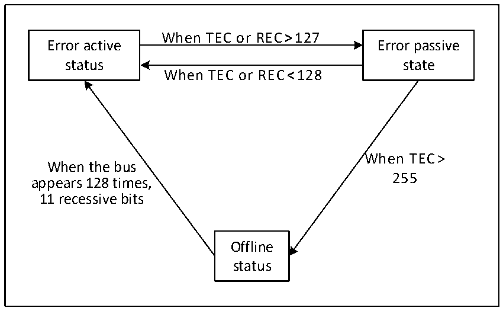

<!-- source-page: 595 -->

[← p.594](0594.md) · [index](../README.md) · [PDF p.595](https://ch32-riscv-ug.github.io/CH32H417/datasheet_en/CH32H417RM.PDF#page=595) · [p.596 →](0596.md)

<!-- header: CH32H417 Reference Manual https://wch-ic.com -->

### 28.5.7 Error Handling

The CAN controller relies on the state error register CANx_ERRSR to manage errors on the bus. The TEC and  
REC in the state error register CANx_ERRSR represent the sending and receiving error count values respectively.  
According to the increase of the sending and receiving errors and the decrease of the sending and receiving  
success, the stability of the CAN bus can be judged according to their values.  
When the TEC and REC in the state error register CANx_ERRSR are less than 128, the current CAN node is in an  
error active state, can normally participate in bus communication, and issue an active error flag when an error is  
detected.  
When the TEC and REC in the state error register CAN_ERRSR are greater than 127, the current CAN node is in  
an error passive state, and when an error is detected, it is not allowed to issue an active error flag, but can only  
issue a passive error flag.  
When the TEC in the status error register CANx_ERRSR is greater than 255, the current CAN node goes offline.  
When the bus monitors 11 consecutive hidden bits for 128times, it returns to the error active state, and the  
recovery mode is affected by the ABOM bit in the main control register CANx_CTLR. If ABOM is set to 1, the  
hardware automatically exits the offline state. If ABOM is 0, the software needs to operate the INRQ bit to enter  
the initialization mode, and then exit the initialization before exiting the offline state.  

Figure 28-6 CAN error state switch diagram  
 <!-- rendered from the PDF; verify at https://ch32-riscv-ug.github.io/CH32H417/datasheet_en/CH32H417RM.PDF#page=595 -->

🖼 Text parsed from the figure above

When TEC or REC&gt;127  
Error active Error passive  
status state  
When TEC or REC&lt;128  
When TEC&gt;  
When the bus  
255  
appears 128 times,  
11 recessive bits  
Offline  
status  

### 28.5.8 Bit Timing

According to the standard of CAN bus, each bit time is divided into four segments: synchronization segment,  
propagation time segment, phase buffer segment 1 and phase buffer segment 2. These segments consist of the  
minimum time unit Tq. The CAN controller monitors the CAN bus change by sampling and synchronizes through  
the edge of the start bit of the frame.  
The CAN controller re-divides the above four segments into 3 segments, which are:  
● Synchronization segment (SS): the synchronization segment in the CAN standard is fixed as a minimum time  
unit, and the expected bit jump normally occurs within this period of time.  
<!-- image: p595-draw-image-00001 bbox=[511.44, 786.36, 530.88, 796.68] -->
<!-- footer: V1.7 593 -->
