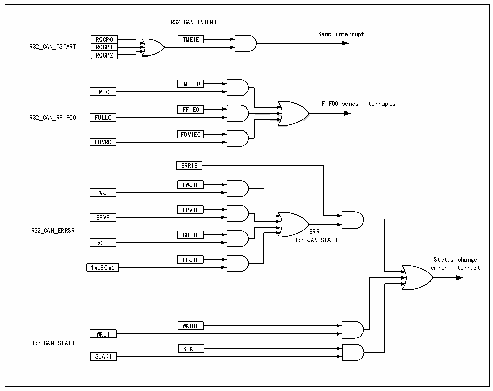

<!-- source-page: 597 -->

[← p.596](0596.md) · [index](../README.md) · [PDF p.597](https://ch32-riscv-ug.github.io/CH32H417/datasheet_en/CH32H417RM.PDF#page=597) · [p.598 →](0598.md)

<!-- header: CH32H417 Reference Manual https://wch-ic.com -->

## 28.6 CAN Interrupt

The CAN controller has 4 interrupt vectors, which are send interrupt, FIFO_0 interrupt, FIFO_1 interrupt, error  
and state change interrupt.  
Set the CAN interrupt allow register CANx_INTENR to allow or disable each interrupt source.  
The sending interrupt is caused by the sending mailbox empty event. After the interrupt is generated, the RQCP0,  
RQCP1 and RQCP2 bits of the register CANx_TSTATR are queried to determine which mailbox empty event is  
generated.  
FIFO0 interrupts are caused by receiving new messages, receiving mailbox fullness and overflow events. After the  
interrupts are generated, the FMP0, FULL0 and FOVER0 bits of register CANx_RFIFO0 are queried to determine  
which mailbox emptiness event is generated.  
Errors and state change interruptions are caused by errors, arousal, and sleep events.  

Figure 28-9 CAN interrupt logic diagram  
 <!-- rendered from the PDF; verify at https://ch32-riscv-ug.github.io/CH32H417/datasheet_en/CH32H417RM.PDF#page=597 -->

🖼 Text parsed from the figure above

R32_CAN_INTENR  
Send interrupt  
RQCP0  RQCP1  RQCP2  
RQCP0 TMEIE  
R32_CAN_TSTART RQCP1  
FMPIE0  
<!-- image: p597-draw-image-00002 inside the figure -->
FMP0  
FIFO0 sends interrupts  
FFIE0  
R32_CAN_RFIF00 FULL0  
FOVIE0  
FOVR0  
ERRIE  
EWGIE  
EWGF  
<!-- image: p597-draw-image-00004 inside the figure -->
EPVIE  
EPVF  
<!-- image: p597-draw-image-00003 inside the figure -->
R32_CAN_ERRSR ERRI  
<!-- image: p597-draw-image-00005 inside the figure -->
BOFIE  
BOFF R32_CAN_STATR  
<!-- image: p597-draw-image-00006 inside the figure -->
LECIE  
LECIE Status change  
1≤LEC≤6 error interrupt  
WKUIE  
WKUI  
R32_CAN_STATR  
SLKIE  
SLAKI  

## 28.7 Register Description

The registers related to the CAN controller must be manipulated in 32-bit words. In order to avoid the influence of  
the current node on the entire CAN bus, the application software can only modify the bit timing register  
<!-- image: p597-draw-image-00001 bbox=[511.44, 786.36, 530.88, 796.68] -->
<!-- footer: V1.7 595 -->
