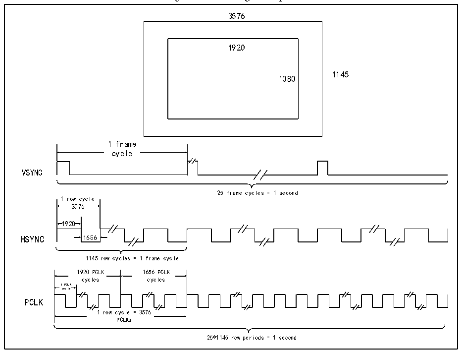

<!-- source-page: 625 -->

[← p.624](0624.md) · [index](../README.md) · [PDF p.625](https://ch32-riscv-ug.github.io/CH32H417/datasheet_en/CH32H417RM.PDF#page=625) · [p.626 →](0626.md)

<!-- header: CH32H417 Reference Manual https://wch-ic.com -->

<!-- p625-table-001 (table-29-1@1) -->
<table><caption>Table 29-1 DVP pins</caption><tr><th>Name</th><th>Signal Type Description</th></tr><tr><td>PLCK</td><td>Pixel clock input</td></tr><tr><td>DATA[11:0]</td><td>Pixel data input</td></tr><tr><td>VSYNC</td><td>Frame sync signal input</td></tr><tr><td>HSYNC</td><td>Line sync signal input</td></tr></table>

### 29.2.2 Working Timing

There is a certain relationship between the digital signal data stream output by the commonly used DVP interface  
sensor module and the image size. The following is an example of image data.  
As shown in Figure 29-2, the inside of the sensor is a complete image size of 3576*1145. After internal scaling  
process, the final image data size output from the interface is 1920*1080, and the image refresh rate is 25.  

Figure 29-2 Timing description  
 <!-- rendered from the PDF; verify at https://ch32-riscv-ug.github.io/CH32H417/datasheet_en/CH32H417RM.PDF#page=625 -->

🖼 Text parsed from the figure above

3576  
1920  
1145  
1080  
1 frame  
cycle  
VSYNC  
25 frame cyc les = 1 second  
1 row cycle  
3576  
1920  
HSYNC 1656  
1145 row cycles = 1 frame cycle  
1920 PCLK 1656 PCLK  
cycles cycles  
1 PCLK  
cycle  
PCLK  
1 row cycle = 3576  
PCLKs  
25*1145 row periods = 1 second  

PCLK is the transmission time of a pixel, so HSYNC is 3576 times more than PCLK. Among the 3576 pixels,  
only 1920 pixels are valid, and the sensor does not transmit data during the remaining 1656 pixels. VSYNC is a  
frame synchronization signal, so the VSYNC time is 3576*1145 times of PCLK. Similarly, the sensor is  
transmitting data only during the 1920*1080 effective pixel time. If the sensor is transmitting JPEG compressed  
data, the HSYNC signal may not be needed.  
The relationship between DVP interface signal and image data is mainly based on the description of the selected  
<!-- image: p625-draw-image-00001 bbox=[511.44, 786.36, 530.88, 796.68] -->
<!-- footer: V1.7 623 -->
