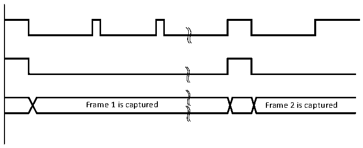
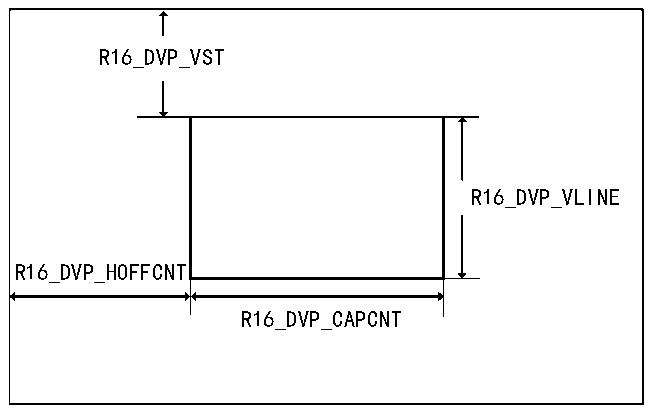

<!-- source-page: 628 -->

[← p.627](0627.md) · [index](../README.md) · [PDF p.628](https://ch32-riscv-ug.github.io/CH32H417/datasheet_en/CH32H417RM.PDF#page=628) · [p.629 →](0629.md)

<!-- header: CH32H417 Reference Manual https://wch-ic.com -->

Figure 29-4 Frame capture waveform in continuous mode  
 <!-- rendered from the PDF; verify at https://ch32-riscv-ug.github.io/CH32H417/datasheet_en/CH32H417RM.PDF#page=628 -->

🖼 Text parsed from the figure above

Frame 1 is captured Frame 2 is captured  

### 29.3.4 Cropping Function Description

DVP can use the crop function to cut a rectangular window from the received image. The starting coordinates of  
the rectangular window (X coordinate of the upper left corner of the rectangle R16_DVP_HOFFCNT, Y  
coordinate R16_DVP_VST) and window size (R16_DVP_CAPCNT represents the horizontal size,  
R16_DVP_VLINE represents the vertical size) are configurable. The coordinates and size of the cropping window  
are shown in Figure 25-5. The cropped window data capture waveform is shown in Figure 29-6.  

Figure 29-5 Crop window coordinates and size  
 <!-- rendered from the PDF; verify at https://ch32-riscv-ug.github.io/CH32H417/datasheet_en/CH32H417RM.PDF#page=628 -->

🖼 Text parsed from the figure above

R16_DVP_VST  
R16_DVP_VLINE  
R16_DVP_HOFFCNT  
R16_DVP_CAPCNT  

<!-- image: p628-draw-image-00001 bbox=[511.44, 786.36, 530.88, 796.68] -->
<!-- footer: V1.7 626 -->
