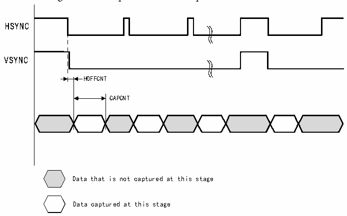

<!-- source-page: 629 -->

[← p.628](0628.md) · [index](../README.md) · [PDF p.629](https://ch32-riscv-ug.github.io/CH32H417/datasheet_en/CH32H417RM.PDF#page=629) · [p.630 →](0630.md)

<!-- header: CH32H417 Reference Manual https://wch-ic.com -->

Figure 29-6 Crop window data capture waveform  
 <!-- rendered from the PDF; verify at https://ch32-riscv-ug.github.io/CH32H417/datasheet_en/CH32H417RM.PDF#page=629 -->

🖼 Text parsed from the figure above

HSYNC  
VSYNC  
HOFFCNT  
CAPCNT  
Data that is not captured at this stage  
Data captured at this stage  

## 29.4 Register Description

<!-- p629-table-001 (table-29-2@1) -->
<table><caption>Table 29-2 DVP registers</caption><tr><th>Name</th><th>Access address</th><th>Description</th><th>Reset value</th></tr><tr><td>R8_DVP_CR0</td><td>0x40025800</td><td>DVP control register0</td><td>0x00</td></tr><tr><td>R8_DVP_CR1</td><td>0x40025801</td><td>DVP control register1</td><td>0x06</td></tr><tr><td>R8_DVP_IER</td><td>0x40025802</td><td>DVP interrupt enable register</td><td>0x00</td></tr><tr><td>R16_DVP_ROW_NUM</td><td>0x40025804</td><td>DVP row number configuration register</td><td>0x0000</td></tr><tr><td>R16_DVP_COL_NUM</td><td>0x40025806</td><td>DVP column number configuration register</td><td>0x0000</td></tr><tr><td>R32_DVP_DMA_BUF0</td><td>0x40025808</td><td>DVP DMA address 0 register</td><td>0x00000000</td></tr><tr><td>R32_DVP_DMA_BUF1</td><td>0x4002580C</td><td>DVP DMA address 1 register</td><td>0x00000000</td></tr><tr><td>R8_DVP_IFR</td><td>0x40025810</td><td>DVP interrupt flag register</td><td>0x00</td></tr><tr><td>R8_DVP_STATUS</td><td>0x40025811</td><td>DVP receive FIFO status register</td><td>0x00</td></tr><tr><td>R16_DVP_ROW_CNT</td><td>0x40025814</td><td>DVP row count register</td><td>0x0000</td></tr><tr><td>R16_DVP_HOFFCNT</td><td>0x40025818</td><td style="text-align:left">Horizontal displacement register for the start of the window</td><td>0x0000</td></tr><tr><td>R16_DVP_VST</td><td>0x4002581A</td><td>Window start line number register</td><td>0x0000</td></tr><tr><td>R16_DVP_CAPCNT</td><td>0x4002581C</td><td>DVP capture count register</td><td>0x0000</td></tr><tr><td>R16_DVP_VLINE</td><td>0x4002581E</td><td>DVP vertical line count register</td><td>0x0000</td></tr><tr><td>R32_DVP_DR</td><td>0x40025820</td><td>DVP data register</td><td>0x00000000</td></tr></table>

### 29.4.1 DVP Control Register (R8_DVP_CR0)

Offset address: 0x00  

<!-- p629-table-002 (table-29-2@1) pages 629-630 -->
<table><tr><th>Bit</th><th>Name</th><th>Access</th><th>Description</th><th>Reset value</th></tr><tr><td>6</td><td>RB_DVP_JPEG</td><td>RW</td><td style="text-align:left">JPEG mode enable. 0: Raw data format; 1: JPEG compression format.</td><td>0</td></tr><tr><td>[5:4]</td><td>RB_DVP_MSK_DAT_MOD[1:0]</td><td>RW</td><td style="text-align:left">DVP data bit width configuration. 00: 8-bit mode; 01: 10-bit mode; 1x: 12-bit mode.</td><td>00b</td></tr><tr><td>3</td><td>RB_DVP_P_POLAR</td><td>RW</td><td style="text-align:left">PCLK polarity configuration. 0: Sample data on the rising edge of PCLK; 1: Sample data on the falling edge of PCLK.</td><td>0</td></tr><tr><td>2</td><td>RB_DVP_H_POLAR</td><td>RW</td><td style="text-align:left">HSYNC polarity configuration. 0: HSYNC high level data is valid; 1: HSYNC low level data is valid.</td><td>0</td></tr><tr><td>1</td><td>RB_DVP_V_POLAR</td><td>RW</td><td style="text-align:left">VSYNC polarity configuration. 0: VSYNC low level data is valid; 1: VSYNC high level data is valid.</td><td>0</td></tr><tr><td>0</td><td>RB_DVP_ENABLE</td><td>RW</td><td style="text-align:left">DVP enable. 0: Disable DVP; 1: Enable DVP.</td><td>0</td></tr></table>

<!-- image: p629-draw-image-00001 bbox=[511.44, 786.36, 530.88, 796.68] -->
<!-- footer: V1.7 627 -->
