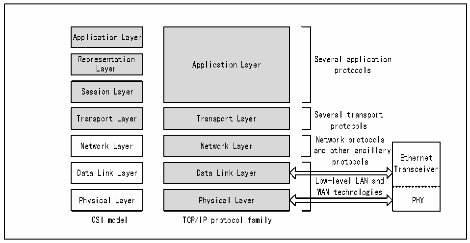

<!-- source-page: 640 -->

[← p.639](0639.md) · [index](../README.md) · [PDF p.640](https://ch32-riscv-ug.github.io/CH32H417/datasheet_en/CH32H417RM.PDF#page=640) · [p.641 →](0641.md)

<!-- header: CH32H417 Reference Manual https://wch-ic.com -->

## 31.2 Overview

Ethernet transceivers work at the data link layer and physical layer in the OSI seven-layer model. In order to  
establish the communication of protocols such as IP, TCP and UDP in the widely used Ethernet, the user also  
needs to implement the TCP/IP protocol stack in software. The Ethernet transceiver is composed of a media  
access control layer (MAC), a matching DMA and their control registers, and a 10M physical layer.  

Figure 31-1 Position of Ethernet Transceivers in OSI Model and TCP/IP Model  
 <!-- rendered from the PDF; verify at https://ch32-riscv-ug.github.io/CH32H417/datasheet_en/CH32H417RM.PDF#page=640 -->

🖼 Text parsed from the figure above

Application Layer  
Representation Several application  
Application Layer  
Layer protocols  
Session Layer  
Several transport  
Transport Layer Transport Layer  
protocols  
Network protocols  
Network Layer Network Layer  
and other ancillary  
Ethernet  
protocols  
Transceiver  
Data Link Layer Data Link Layer  
Low-level LAN and  
WAN technologies  
Physical Layer Physical Layer PHY  
OSI model TCP/IP protocol family  

The MAC of the Ethernet transceiver is designed according to the specifications of the IEEE802.3 protocol, and is  
equipped with a 256-bit wide DMA to ensure that the data can be quickly forwarded from the network cable to the  
memory of the microcontroller. The Ethernet transceiver has powerful and complete DMA control registers, MAC  
control registers and mode control registers. The microcontroller&#x27;s CPU operates the registers of the Ethernet  
transceiver through the HB bus. The Ethernet transceiver is connected to the gigabit Ethernet physical layer  
through the RGMII interface. If only the speed of 100M Ethernet is required, it can be connected to the 100M  
Ethernet physical layer through the MII or RMII interface. The pins of the MII, RMII and RGMII interfaces of the  
Ethernet transceiver are multiplexed, see section 31.3 for details. The Ethernet transceiver manages the Ethernet  
physical layer through the SMI interface. When using an Ethernet transceiver, the clock of the HB bus cannot be  
lower than 50MHz.  
<!-- image: p640-draw-image-00001 bbox=[511.44, 786.36, 530.88, 796.68] -->
<!-- footer: V1.7 638 -->
