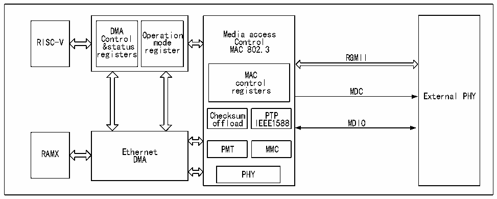

<!-- source-page: 641 -->

[← p.640](0640.md) · [index](../README.md) · [PDF p.641](https://ch32-riscv-ug.github.io/CH32H417/datasheet_en/CH32H417RM.PDF#page=641) · [p.642 →](0642.md)

<!-- header: CH32H417 Reference Manual https://wch-ic.com -->

Figure 31-2 Block diagram of Ethernet Transceiver  
 <!-- rendered from the PDF; verify at https://ch32-riscv-ug.github.io/CH32H417/datasheet_en/CH32H417RM.PDF#page=641 -->

🖼 Text parsed from the figure above

DMA Operation Media access  
RISC-V Control mode Control  
&amp;status register MAC 802.3  
registers  
RGMII  
MAC  
control  
registers MDC  
External PHY  
Checksum PTP  
offload IEEE1588 MDIO  
RAMX Ethernet PMT MMC  
DMA  
PHY  

In addition, the Ethernet transceiver also supports the IEEE1588 Precision Time Protocol (PTP) to provide precise  
time data for microcontroller systems or off-chip.  

## 31.3 Ethernet Transceiver Pinouts and Configuration

The microcontroller supports RGMII interface. The RGMII interface can be used for 10M, 100M and Gigabit  
Ethernet. The following table shows the distribution of standard RGMII interfaces and internal physical layers on  
package pins.  
and other related pinouts and required configuration  

<!-- p641-table-001 (table-31-1@1) -->
<table><caption>Table 31-1 Media independent interface of microcontroller, media dependent interface with built-in physical layer</caption><tr><th>Pins</th><th>RGMII</th><th>RGMII pin configuration</th></tr><tr><td>PD15</td><td>GTXC</td><td>Push-pull multiplexed output</td></tr><tr><td>PA14</td><td>RXDV</td><td>Floating input</td></tr><tr><td>PA15</td><td>GRXC</td><td>Floating input</td></tr><tr><td>PC6</td><td>RXD3</td><td>Floating input</td></tr><tr><td>PD13</td><td>TXD0</td><td>Push-pull multiplexed output</td></tr><tr><td>PD12</td><td>TXD1</td><td>Push-pull multiplexed output</td></tr><tr><td>PD11</td><td>TXD2</td><td>Push-pull multiplexed output</td></tr><tr><td>PD10</td><td>TXD3</td><td>Push-pull multiplexed output</td></tr><tr><td>PC8</td><td>RXD1</td><td>Floating input</td></tr><tr><td>PC0</td><td>MDC</td><td>Push-pull multiplexed output</td></tr><tr><td>PC1</td><td>MDIO</td><td>Push-pull multiplexed output</td></tr><tr><td>PC9</td><td>RXD0</td><td>Floating input</td></tr><tr><td>PC7</td><td>RXD2</td><td>Floating input</td></tr><tr><td>PD14</td><td>TXEN</td><td>Push-pull multiplexed output</td></tr><tr><td>PC2</td><td>PPS</td><td>Push-pull multiplexed output</td></tr><tr><td>-</td><td>MDITP</td><td>No IO configuration required</td></tr><tr><td>-</td><td>MDITN</td><td>No IO configuration required</td></tr><tr><td>-</td><td>MDIRP</td><td>No IO configuration required</td></tr><tr><td>-</td><td>MDIRN</td><td>No IO configuration required</td></tr></table>

<!-- image: p641-draw-image-00001 bbox=[511.44, 786.36, 530.88, 796.68] -->
<!-- footer: V1.7 639 -->
