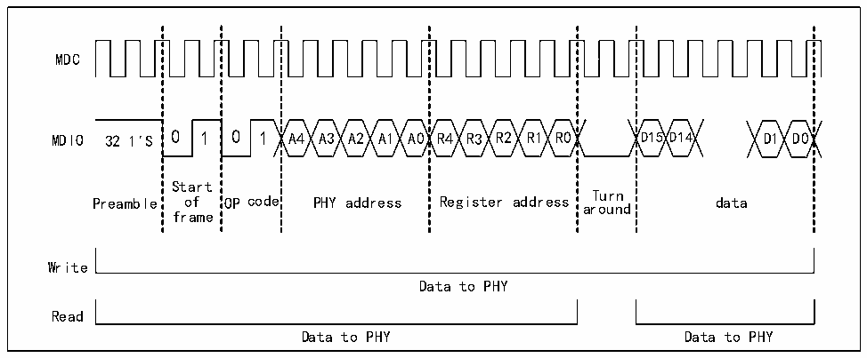

<!-- source-page: 643 -->

[← p.642](0642.md) · [index](../README.md) · [PDF p.643](https://ch32-riscv-ug.github.io/CH32H417/datasheet_en/CH32H417RM.PDF#page=643) · [p.644 →](0644.md)

<!-- header: CH32H417 Reference Manual https://wch-ic.com -->
the write operation according to the busy bit. The write part of Figure 31-3.  
The operation of reading the PHY register is as follows:  
When the user sets the MII busy bit of the MII address register (ETH_MACMIIAR) of the Ethernet MAC and  
keeps the MII write bit reset, the SMI interface sends the PHY address and register address, and performs the  
operation of reading the PHY register. During the entire transfer process, the user cannot modify the contents of  
the MII address register and the MII data register. During the transfer, the busy bit remains high, and writes to the  
MII address register or the MII data register will be ignored and will not affect the correct completion of the entire  
transfer. After the read operation is completed, the SMI interface will clear the busy bit and write the data read  
back from the PHY into the MII data register. The read section of Figure 31-3.  

Figure 31-3 SMI interface read and write time diagram  
 <!-- rendered from the PDF; verify at https://ch32-riscv-ug.github.io/CH32H417/datasheet_en/CH32H417RM.PDF#page=643 -->

🖼 Text parsed from the figure above

MDC  
MDIO 32 1&#x27;S 0 1 0 1 A4 A3 A2 A1 A0 R4 R3 R2 R1 R0 D15 D14 D1 D0  
Start  
Turn  
Preamble of OP code PHY address Register address around data  
frame  
Write  
Data to PHY  
Read  
Data to PHY Data to PHY  

#### 31.4.1.3 SMI Clock

Generally speaking, the SMI clock needs to be kept in a fixed range to ensure that the SMI clock actually needs to  
be received by the PHY. For details, refer to the manual of the PHY chip selected by the user.  
The SMI clock frequency is divided from the HB clock by the CR field of the MII address register  
(ETH_MACMIIAR). The following table shows the frequency division relationship between SMI clock and HB  
clock. By default, divide by 42 is selected.  

<!-- p643-table-001 (table-31-3@1) -->
<table><caption>Table 31-3 Frequency division relationship between SMI clock and HB clock</caption><tr><th></th><th style="text-align:left">Range of AHB clocks suitable for matching</th><th>SMI clock</th></tr><tr><td>0000b</td><td>Above 60MHz</td><td>HB clock/42</td></tr><tr><td>0010b</td><td>20-35MHz</td><td>HB clock/16</td></tr><tr><td>0011b</td><td>35-60MHz</td><td>HB clock/26</td></tr><tr><td>other values</td><td colspan="2">meaningless</td></tr></table>

### 31.4.2 RGMII interface

#### 31.4.2.1 Pins

The pins and functions of the RGMII are as follows  
<!-- image: p643-draw-image-00001 bbox=[511.44, 786.36, 530.88, 796.68] -->
<!-- footer: V1.7 641 -->
