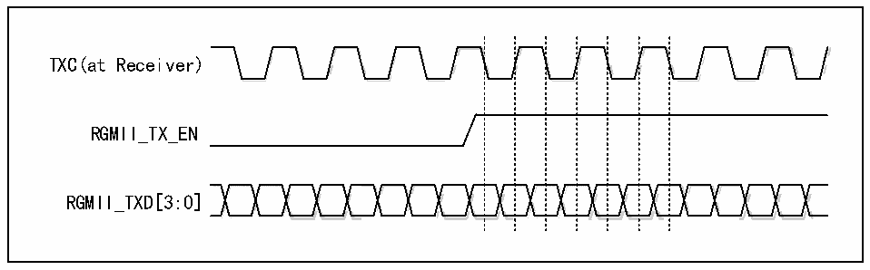

<!-- source-page: 644 -->

[← p.643](0643.md) · [index](../README.md) · [PDF p.644](https://ch32-riscv-ug.github.io/CH32H417/datasheet_en/CH32H417RM.PDF#page=644) · [p.645 →](0645.md)

<!-- header: CH32H417 Reference Manual https://wch-ic.com -->

<!-- p644-table-001 (table-31-4@1) -->
<table><caption>Table 31-4 RGMII pins and functions</caption><tr><th>Pins</th><th>Features</th></tr><tr><td>TXC</td><td>Transmit clock</td></tr><tr><td>TXCTL</td><td>Transmit data control</td></tr><tr><td>TXD0</td><td rowspan="4">Transmit data lines [0:3]</td></tr><tr><td>TXD1</td></tr><tr><td>TXD2</td></tr><tr><td>TXD3</td></tr><tr><td>RXC</td><td>Receive clock</td></tr><tr><td>RXCTL</td><td>Receive data control</td></tr><tr><td>RXD0</td><td rowspan="4">Receive data lines[0:3]</td></tr><tr><td>RXD1</td></tr><tr><td>RXD2</td></tr><tr><td>RXD3</td></tr></table>

<em>Note: 1. TXCTL/RXCTL is used in the Ethernet transceiver of this microcontroller as a valid signal for sending</em>  
<em>and receiving data;</em>  
<em>2. RGMII has an independent SMI interface.</em>  

#### 31.4.2.2 Timing

RGMII works in 10M and 100M rate modes, and the timing is similar to MII; when working in gigabit, the clock  
of RGMII is 125MHz, and the double-edge sampling method is adopted. RGMII does not support half-duplex.  
Since RGMII uses double-edge sampling and operates at a clock frequency of 125MHz, circuit designers should  
be aware of signal integrity issues.  
The clock received by the receiver of the RGMII should lag the data by 90° to ensure correct sampling. Ethernet  
transceivers are designed to transmit clock delay output and phase inversion.  

Figure 31-4 RGMII timing diagram  
 <!-- rendered from the PDF; verify at https://ch32-riscv-ug.github.io/CH32H417/datasheet_en/CH32H417RM.PDF#page=644 -->

🖼 Text parsed from the figure above

<!-- image: p644-draw-image-00002 inside the figure -->
TXC(at Receiver)  
RGMII_TX_EN  
<!-- image: p644-draw-image-00003 inside the figure -->
RGMII_TXD[3:0]  

<!-- image: p644-draw-image-00001 bbox=[511.44, 786.36, 530.88, 796.68] -->
<!-- footer: V1.7 642 -->
