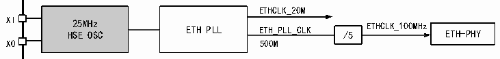

<!-- source-page: 645 -->

[← p.644](0644.md) · [index](../README.md) · [PDF p.645](https://ch32-riscv-ug.github.io/CH32H417/datasheet_en/CH32H417RM.PDF#page=645) · [p.646 →](0646.md)

<!-- header: CH32H417 Reference Manual https://wch-ic.com -->

### 31.4.3 Peripheral clock source configuration

Figure 31-5 Ethernet peripheral clock tree  
 <!-- rendered from the PDF; verify at https://ch32-riscv-ug.github.io/CH32H417/datasheet_en/CH32H417RM.PDF#page=645 -->

🖼 Text parsed from the figure above

ETHCLK_20M  
XI HS 25 E M H O z SC ETH PLL ETH_PLL_CLK /5 ETHCLK_100MHz ETH-PHY  
XO 500M  

> ⚠ Table extraction recorded 1 issue(s) (overlapping merged cells); verify against [the PDF, p.645](https://ch32-riscv-ug.github.io/CH32H417/datasheet_en/CH32H417RM.PDF#page=645).

<!-- p645-table-001 (table-31-4@1) -->
<table><tr><th rowspan="2" colspan="2" style="text-align:left">GTXC to Ethernet MACRGMIIONGRXCETH_PLL_CLK/4SERDES_PLL_CLK/8ETHCLK_125MPLL_CLKUSBSS_PLL_CLK ETH1GSRC RGMII interface</th><th>to Ethernet MAC</th></tr><tr></tr></table>

GTXC  
GRXC  
When using RGMII, set RCC_CFGR0[21] to 1 to enable RGMII mode, and configure RCC_CFG2[31:30] to  
select the appropriate 125MHz clock source for the MAC. The RGMII transmit clock GTXC is generated by the  
MAC, while the receive clock GRXC is generated by the PHY. For details, see EVT routines on the official  
website.  

## 31.5 IEEE802.3 and IEEE1588

The IEEE802.3 protocol and its supplementary protocols constitute the official standard of the current Ethernet,  
which defines all aspects of the currently used Ethernet in detail. We can think of Ethernet as part of the physical  
layer and data link layer in the OSI model. This section discusses the parts that users need to use in the IEEE802.3  
protocol from the application point of view, that is, the frame format and the content related to the MAC address.  
At the same time, the Ethernet transceiver of the microcontroller also supports the IEEE1588 Precision Time  
Protocol, which will also be discussed in part in this article.  
In the Ethernet model constructed by the IEEE802.3 protocol, the data transmission unit is an Ethernet frame.  
Ethernet frames have different encoding forms when transmitted on different media at different rates. After  
receiving, they are decoded by the physical layer and sent to the MAC through the MII interface. After the MAC  
checksum is filtered, it is extracted by the TCP/IP protocol stack. Application information is sent to different  
application processes.  

### 31.5.1 Frame Format

The frame format of an Ethernet frame is shown in Table 31-5.  

<!-- p645-table-002 (table-31-5@1) pages 645-646 -->
<table><caption>Table 31-5 Normal Ethernet frame format</caption><tr><th>Preamble</th><th>SFD</th><th style="text-align:left">Target address</th><th style="text-align:left">Source address</th><th>Length/Type</th><th>Data field</th><th>CRC</th></tr><tr><td>7 Bytes</td><td>1Byte</td><td>6 Bytes</td><td>6 Bytes</td><td>2 Bytes</td><td>46-1500 Bytes</td><td>4 Bytes</td></tr><tr><td colspan="7" style="text-align:left">Total length: 64 to 1518 bytes plus 8 bytes of physical layer header (Preamble and SFD)</td></tr></table>

<!-- image: p645-draw-image-00001 bbox=[511.44, 786.36, 530.88, 796.68] -->
<!-- footer: V1.7 643 -->
