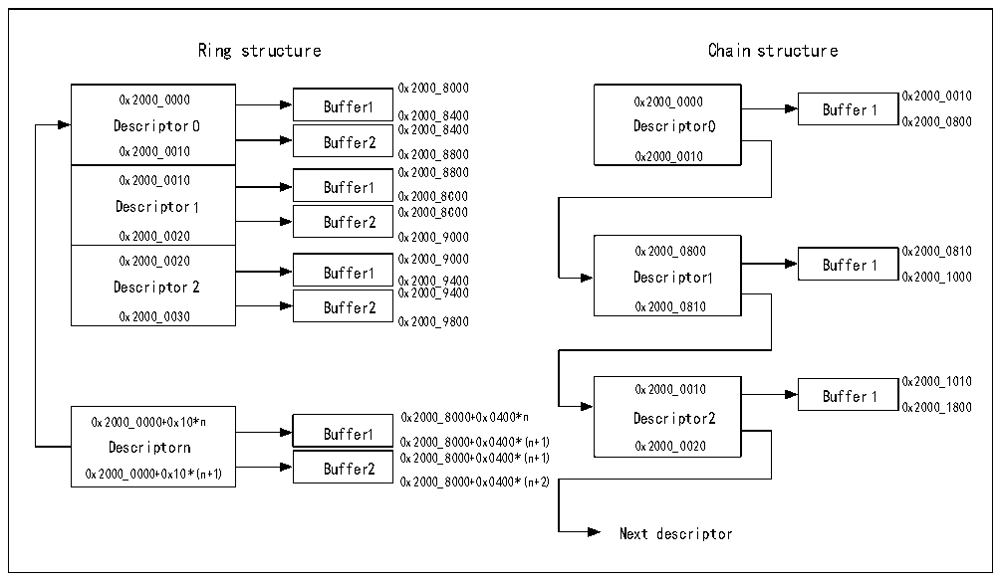

<!-- source-page: 654 -->

[← p.653](0653.md) · [index](../README.md) · [PDF p.654](https://ch32-riscv-ug.github.io/CH32H417/datasheet_en/CH32H417RM.PDF#page=654) · [p.655 →](0655.md)

<!-- header: CH32H417 Reference Manual https://wch-ic.com -->
DMA descriptors are divided into 2 types: sending and receiving, and each format is fixed. The storage structure  
of DMA descriptors is divided into 2 types, one is linked list form, that is, the fourth word of each descriptor is the  
address of the next descriptor, and the DMA controller will directly read the next descriptor from TDes3/RDes3.  
The other is a ring structure, where all descriptors must be closely arranged, DMA control takes a descriptor from  
the end of the current descriptor, when the DMA controller detects the TER/RER bit of TDes4/RDes4, i.e., from  
the beginning of the descriptor list. The address of the descriptor array must be 4-byte aligned, and the size of a  
single descriptor is 16 bytes.  

Figure 31-8 A buffer allocation scheme which describes the ring structure and the chain structure for reference  
 <!-- rendered from the PDF; verify at https://ch32-riscv-ug.github.io/CH32H417/datasheet_en/CH32H417RM.PDF#page=654 -->

when users allocate space.  

🖼 Text parsed from the figure above

Ring structure Chain structure  
0x2000_8000  
0x2000_0000 Descriptor 00x2000_0010  0x2000_0010 Descriptor 10x2000_0020  0x2000_0020 Descriptor 20x2000_0030  
Buffer1  Buffer2  
0x2000_0000 Buffer1 0x2000_0000 Buffer 1 0x2000_0010  
Descriptor 0 0 0 x x 2 2 0 0 0 0 0 0 _ _ 8 8 4 4 0 0 0 0 Descriptor0 0x2000_0800  
0x2000_0010 0x2000_8800 0x2000_0010  
0x2000_8800  
Buffer1  Buffer2  
0x2000_0010 Buffer1  
0x2000_8C00  
0x2000_8C00  
0x2000_0020 0x2000_9000  
0x2000_0800 0x2000_0810  
Buffer1  Buffer2  
0x2000_0020 0x2000_9000 Buffer 1  
Descriptor 2 Buffer1 0x2000_9400 Descriptor1 0x2000_1000  
0x2000_9400  
Buffer2 0x2000_0810  
0x2000_1010  
0x2000_0010 Buffer 1  
0x2000_1800  
0x2000_0000+0x10*n 0x2000_8000+0x0400*n Descriptor2  
Buffer1  Buffer2  
Descriptorn 0x2000_8000+0x0400*(n+1) 0x2000_0020  
0x2000_8000+0x0400*(n+1)  
0x2000_0000+0x10*(n+1)  
0x2000_8000+0x0400*(n+2)  
Next descriptor  

#### 31.6.2.1 Transmit DMA Descriptor

Table 31-9, 31-10 shows the structure of the transmit descriptor.  
31 0  

<!-- p654-table-006 (table-31-9@1) -->
<table><caption>Table 31-9 Structure of the transmit descriptor</caption><tr><th style="text-align:left">OWM (31)</th><th colspan="2" style="text-align:left">CTRL (30:26)</th><th style="text-align:left">TTSE (25)</th><th>Reserved</th><th colspan="2" style="text-align:left">Control （23:20）</th><th colspan="2" style="text-align:left">Reserved (19:18)</th><th style="text-align:left">TTSS (17)</th><th style="text-align:left">State （16:0）</th></tr><tr><td colspan="2" style="text-align:left">Reserved （31:29）</td><td colspan="4" style="text-align:left">Buffer 2-byte count （28:16）</td><td colspan="2" style="text-align:left">Reserved （15:13）</td><td colspan="3" style="text-align:left">Buffer 1-byte count （12:0）</td></tr><tr><td colspan="11">Buffer 1 address, timestamp low</td></tr><tr><td colspan="11" style="text-align:left">Buffer 2 address, address of next descriptor, timestamp high</td></tr></table>

<!-- image: p654-draw-image-00001 bbox=[511.44, 786.36, 530.88, 796.68] -->
<!-- footer: V1.7 652 -->
