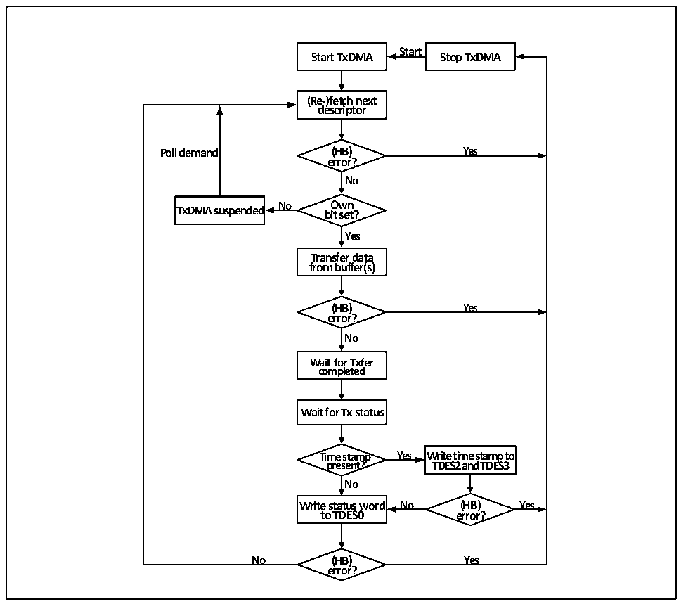

<!-- source-page: 665 -->

[← p.664](0664.md) · [index](../README.md) · [PDF p.665](https://ch32-riscv-ug.github.io/CH32H417/datasheet_en/CH32H417RM.PDF#page=665) · [p.666 →](0666.md)

<!-- header: CH32H417 Reference Manual https://wch-ic.com -->
DMA controller will set the transmit completion interrupt flag (DMASR:0), and then continue to fetch the  
next transmit descriptor.  
The following figure shows the default process of transmission.  

Figure 31-9 Process of transmission  
 <!-- rendered from the PDF; verify at https://ch32-riscv-ug.github.io/CH32H417/datasheet_en/CH32H417RM.PDF#page=665 -->

🖼 Text parsed from the figure above

<strong>Start</strong>  
<strong>Start TxDMA Stop TxDMA</strong>  
<strong>(Re-)fetch next</strong>  
<strong>descriptor</strong>  
<strong>Poll demand (HB) Yes</strong>  
<strong>error?</strong>  
<strong>No</strong>  
<strong>TxDMA suspended No b O it w se n t ?</strong>  
<strong>Yes</strong>  
<strong>Transfer data</strong>  
<strong>from buffer(s)</strong>  
<strong>(HB) Yes</strong>  
<strong>error?</strong>  
<strong>No</strong>  
<strong>Wait for Txfer</strong>  
<strong>completed</strong>  
<strong>Wait for Tx status</strong>  
<strong>Time stamp Yes Write time stamp to</strong>  
<strong>present? TDES2 and TDES3</strong>  
<strong>No</strong>  
<strong>Write status word No (HB) Yes</strong>  
<strong>to TDES0 error?</strong>  
<strong>No (HB) Yes</strong>  
<strong>error?</strong>  

#### 31.6.4.2 Receive DMA Configuration

The steps to establish a DMA receive flow mechanism are as follows:  
1） Set the transmit buffer queue and descriptor queue, and set up the bits of each field of the receive descriptor;  
register the initial address of the descriptor in the DMARDLAR register; set the OWN bit to give the  
descriptor use permission to the DMA controller;  
2） Set the SR bit to start the receiving process;  
3） When the receive flow mechanism is running, the DMA controller obtains the next descriptor, checks the  
receiving descriptor configuration, and when the FIFO receives the next frame, performs multiple checks  
such as filtering and identifying the frame content, and forwards the frame data to the buffer specified by the  
symbol, writes the descriptor status field and obtains the next receiving descriptor, and reports the receiving  
completion interrupt. If the frame does not pass the filtering, it will be marked or discarded. If the frame has  
<!-- image: p665-draw-image-00001 bbox=[511.44, 786.36, 530.88, 796.68] -->
<!-- footer: V1.7 663 -->
