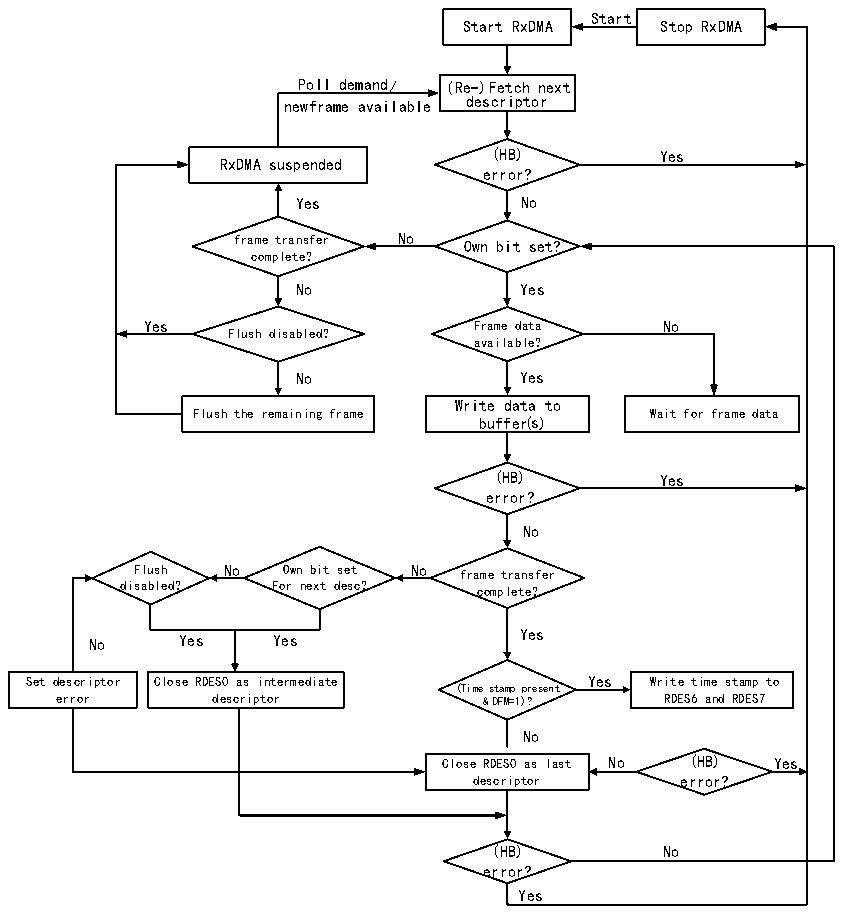

<!-- source-page: 666 -->

[← p.665](0665.md) · [index](../README.md) · [PDF p.666](https://ch32-riscv-ug.github.io/CH32H417/datasheet_en/CH32H417RM.PDF#page=666) · [p.667 →](0667.md)

<!-- header: CH32H417 Reference Manual https://wch-ic.com -->
a checksum error, CRC error or the frame is too short, it will be marked. If the frame is too long, it may be  
cut off or receive a watchdog timeout error. The DMA controller will stop the receiving process when it  
encounters a fatal error such as the unavailability of the receive descriptor, and the user needs to pay special  
attention;  
4） The user needs to enable at least one receive completion interrupt, and restore the used receive descriptor to  
the standby state in the Ethernet interrupt function to ensure that the receive process can run uninterrupted.  
The user can pass the address of the data buffer to be processed in the interrupt function, or handle some  
abnormal events that interrupt the receiving process.  
5） If the MAC opens the IEEE1588PTP mode and enables the enhanced descriptor, when the DMA controller  
dumps data and writes the descriptor status field, the current timestamp will also be written into the last two  
words of the descriptor.  
The following figure shows the default flow mechanism of reception:  

Figure 31-10 Process of reception  
 <!-- rendered from the PDF; verify at https://ch32-riscv-ug.github.io/CH32H417/datasheet_en/CH32H417RM.PDF#page=666 -->

🖼 Text parsed from the figure above

Start  
Start RxDMA Stop RxDMA  
Poll demand/ (Re-)Fetch next  
newframe available descriptor  
(HB) Yes  
RxDMA suspended  
error?  
Yes No  
frame transfer No Own bit set?  
complete?  
No Yes  
Yes Frame data No  
Flush disabled?  
available?  
No Yes  
Write data to  
Flush the remaining frame Wait for frame data  
buffer(s)  
(HB) Yes  
error?  
No  
Flush No Own bit set No frame transfer  
disabled? For next desc? complete?  
No Yes Yes Yes  
Set descriptor Close RDES0 as intermediate Yes Write time stamp to  
(Time stamp present  
error descriptor &amp; DFM=1)? RDES6 and RDES7  
No  
Close RDES0 as last No (HB) Yes  
descriptor error?  
(HB) No  
error?  
Yes  

<!-- image: p666-draw-image-00001 bbox=[511.44, 786.36, 530.88, 796.68] -->
<!-- footer: V1.7 664 -->
