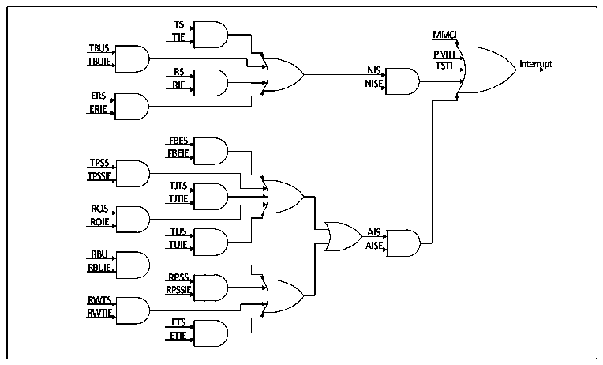

<!-- source-page: 667 -->

[← p.666](0666.md) · [index](../README.md) · [PDF p.667](https://ch32-riscv-ug.github.io/CH32H417/datasheet_en/CH32H417RM.PDF#page=667) · [p.668 →](0668.md)

<!-- header: CH32H417 Reference Manual https://wch-ic.com -->

## 31.7 Interrupt

The Ethernet transceiver has 2 interrupt vectors, one is the Ethernet wake-up event and the other is the normal  
transceiver event. When a wake-up frame or magic frame is detected, an Ethernet wake-up event is triggered.  
Common Ethernet transceiver interrupt events include DMA interrupt and ETH interrupt.  

### 31.7.1 DMA Interrupt

DMA interrupts can be roughly divided into 2 groups, namely normal interrupts (NIS) and abnormal interrupts  
(AIS). Abnormal interrupts generally mean abnormal data transmission and reception, which requires special  
attention. When processing interrupts, users need to retrieve all interrupt flag bits and process all generated  
interrupt sources. The following figure is a schematic diagram of the interrupt of the Ethernet transceiver.  

Figure 31-11 Interrupt schematic  
 <!-- rendered from the PDF; verify at https://ch32-riscv-ug.github.io/CH32H417/datasheet_en/CH32H417RM.PDF#page=667 -->

🖼 Text parsed from the figure above

<!-- image: p667-draw-image-00022 inside the figure -->
<!-- image: p667-draw-image-00028 inside the figure -->
<!-- image: p667-draw-image-00023 inside the figure -->
<!-- image: p667-draw-image-00024 inside the figure -->
<!-- image: p667-draw-image-00029 inside the figure -->
<!-- image: p667-draw-image-00025 inside the figure -->
<!-- image: p667-draw-image-00035 inside the figure -->
<!-- image: p667-draw-image-00030 inside the figure -->
<!-- image: p667-draw-image-00031 inside the figure -->
<!-- image: p667-draw-image-00002 inside the figure -->
<!-- image: p667-draw-image-00032 inside the figure -->
<!-- image: p667-draw-image-00003 inside the figure -->
<!-- image: p667-draw-image-00004 inside the figure -->
<!-- image: p667-draw-image-00005 inside the figure -->
<!-- image: p667-draw-image-00006 inside the figure -->
<!-- image: p667-draw-image-00007 inside the figure -->
<!-- image: p667-draw-image-00012 inside the figure -->
<!-- image: p667-draw-image-00013 inside the figure -->
<!-- image: p667-draw-image-00026 inside the figure -->
<!-- image: p667-draw-image-00027 inside the figure -->
<!-- image: p667-draw-image-00018 inside the figure -->
<!-- image: p667-draw-image-00019 inside the figure -->
<!-- image: p667-draw-image-00014 inside the figure -->
<!-- image: p667-draw-image-00033 inside the figure -->
<!-- image: p667-draw-image-00015 inside the figure -->
<!-- image: p667-draw-image-00034 inside the figure -->
<!-- image: p667-draw-image-00008 inside the figure -->
<!-- image: p667-draw-image-00009 inside the figure -->
<!-- image: p667-draw-image-00020 inside the figure -->
<!-- image: p667-draw-image-00021 inside the figure -->
<!-- image: p667-draw-image-00016 inside the figure -->
<!-- image: p667-draw-image-00017 inside the figure -->
<!-- image: p667-draw-image-00010 inside the figure -->
<!-- image: p667-draw-image-00011 inside the figure -->

The DMA interrupt is the most important interrupt in the Ethernet transceiver. Generally, user logic needs to rely  
on interrupts to receive frames, confirm that the frames are sent, or deal with the interrupted transceiver logic in  
time.  

### 31.7.2 ETH Interrupt

The ETH interrupt mainly includes the time alarm trigger of PTP, the sending and receiving count to a certain set  
value of the MMC register, and the PMT. The usefulness of ETH is mainly functional, not very complex and  
important relative to DMA interrupts. Users can use PTP interrupt for alarm clock, MMC interrupt for speed  
measurement, or PMT interrupt for remote wake-up. In addition, ETH also supports interrupts when the state of  
the built-in physical layer connection changes.  

### 31.7.3 PMT Interrupt

The reason why the PMT interrupt is raised separately and reiterated is that this interrupt has an independent  
interrupt vector and needs to be paid attention to when using it.  
<!-- image: p667-draw-image-00001 bbox=[511.44, 786.36, 530.88, 796.68] -->
<!-- footer: V1.7 665 -->
