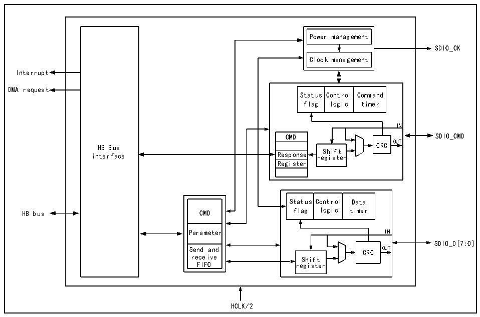

<!-- source-page: 708 -->

[← p.707](0707.md) · [index](../README.md) · [PDF p.708](https://ch32-riscv-ug.github.io/CH32H417/datasheet_en/CH32H417RM.PDF#page=708) · [p.709 →](0709.md)

<!-- header: CH32H417 Reference Manual https://wch-ic.com -->

## 32.2 Interface and Clock

SDIO receives the control of the CPU through the HB bus. There is a FIFO interface in the SDIO register. The  
CPU or DMA obtains or generates data by reading and writing the FIFO. SDIO is directly clocked by HCLK, and  
has an interrupt entry that supports multiple interrupt sources. The pins directly controlled by SDIO are SDIO_CK,  
SDIO_CMD, SDIO_D [7:0], which are connected to SDIO devices through several pins. SDIO is a  
host-dominated communication interface, and all transfers must be initiated by the microcontroller.  

### 32.2.1 Peripheral Structure

The structure of SDIO is shown in Figure 32-1.  

Figure 32-1 SDIO structure diagram  
 <!-- rendered from the PDF; verify at https://ch32-riscv-ug.github.io/CH32H417/datasheet_en/CH32H417RM.PDF#page=708 -->

🖼 Text parsed from the figure above

Power management  Clock management  
SDIO_CK  
Interrupt  
DMA request  
Status flag  Control logic  Command timer  
IN  
CMD  Response  Response  Register  
CMD SDIO_CMD  
OUT  
HB Bus CRC  
interface Response re S g h i i s f t t e r  
Status flag  Control logic  Data timer  
CMD  Parameter  Send and receive FIFO  
Parameter IN  
SDIO_D[7:0]  
Send and CRC OUT  
receive Shift  
FIFO register  
HCLK/2  

SDIO is a peripheral that the microcontroller directly operates the SDIO device as a host. It is roughly composed  
of 5 modules: HB interface, clock control part, CMD line control part, data line control part and control register  
part. SDIO is a half-duplex for peripherals, the CPU writes the commands and data to be sent to the control  
register, and the command line and data line control module is responsible for pushing the command or data to the  
IO and adding CRC. The data flow of SDIO is responsible for the transfer from RAM to SDIO FIFO by  
general-purpose DMA. SDIO FIFO has 32 32-bit sizes.  

### 32.2.2 Pins and Configuration

The pins that need to be configured for SDIO and their modes are shown in Table 32-1.  

<!-- p708-table-007 (table-32-1@1) pages 708-709 -->
<table><caption>Table 32-1 SDIO pin configuration</caption><tr><th>SDIO alternate function</th><th>Required pin mode</th></tr><tr><td>SDIO_D[0:3]</td><td>Push-pull alternate output</td></tr><tr><td>SDIO_CK</td><td>Push-pull alternate output</td></tr><tr><td>SDIO_CMD</td><td>Push-pull alternate output</td></tr><tr><td>SDIO_D4</td><td>Push-pull alternate output</td></tr><tr><td>SDIO_D5</td><td>Push-pull alternate output</td></tr><tr><td>SDIO_D6</td><td>Push-pull alternate output</td></tr><tr><td>SDIO_D7</td><td>Push-pull alternate output</td></tr></table>

<!-- image: p708-draw-image-00001 bbox=[511.44, 786.36, 530.88, 796.68] -->
<!-- footer: V1.7 706 -->
