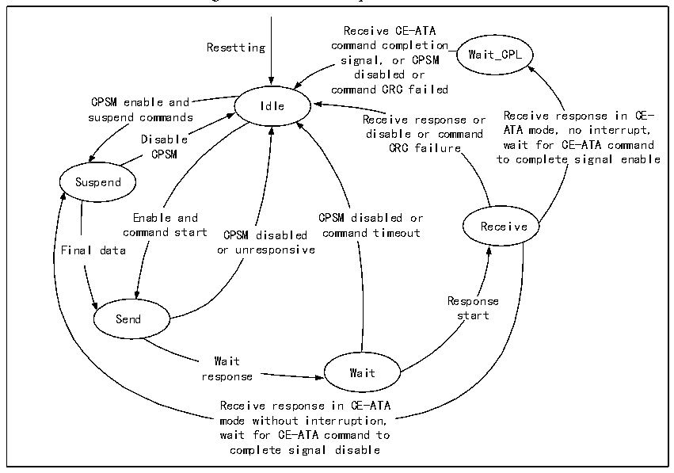

<!-- source-page: 709 -->

[← p.708](0708.md) · [index](../README.md) · [PDF p.709](https://ch32-riscv-ug.github.io/CH32H417/datasheet_en/CH32H417RM.PDF#page=709) · [p.710 →](0710.md)

<!-- header: CH32H417 Reference Manual https://wch-ic.com -->

> ⬆ **Table continued** — rendered in full at [page 708](0708.md). <!-- p709-table-001 -->

<em>Note: The SDIO_CK pin should be configured as a float input when in slave mode.</em>  

### 32.2.3 Clock

The clock pin of SDIO is SDIO_CK, and its output clock is obtained by dividing the frequency of HCLK, and the  
frequency dividing coefficient can be configured as any integer value between 2 and 261. SDIO devices generally  
only support a single bus mode with a clock of up to 400kHz during initialization. After initialization, the host  
generally initiates a switch to a low voltage operation, and at the same time increases the clock to the maximum  
clock that both the microcontroller and the SDIO device can accept. Different versions and speed grades of SD  
cards support different clock speeds and switching processes, and users need to understand for themselves.  

### 32.2.4 Command Path State Machine

The command workflow of SDIO follows the state machine shown in the figure below.  

Figure 32-2 Command path state machine  
 <!-- rendered from the PDF; verify at https://ch32-riscv-ug.github.io/CH32H417/datasheet_en/CH32H417RM.PDF#page=709 -->

🖼 Text parsed from the figure above

Receive CE-ATA  
Resetting command completion  
signal, or CPSM Wait_CPL  
disabled or  
command CRC failed  
CPSM enable and Idle  
suspend commands Receive response or Receive response in CE-  
disable or command ATA mode, no interrupt,  
Disable  
CRC failure wait for CE-ATA command  
CPSM  
to complete signal enable  
Suspend  
Enable and CPSM disabled or  
Receive  
command start CPSM disabled command timeout  
Final data or unresponsive  
Response  
Send start  
Wait  
response Wait  
Receive response in CE-ATA  
mode without interruption,  
wait for CE-ATA command to  
complete signal disable  

### 32.2.5 Data Path State Machine

The data workflow of SDIO follows the state machine shown in the figure below.  
<!-- image: p709-draw-image-00001 bbox=[511.44, 786.36, 530.88, 796.68] -->
<!-- footer: V1.7 707 -->
