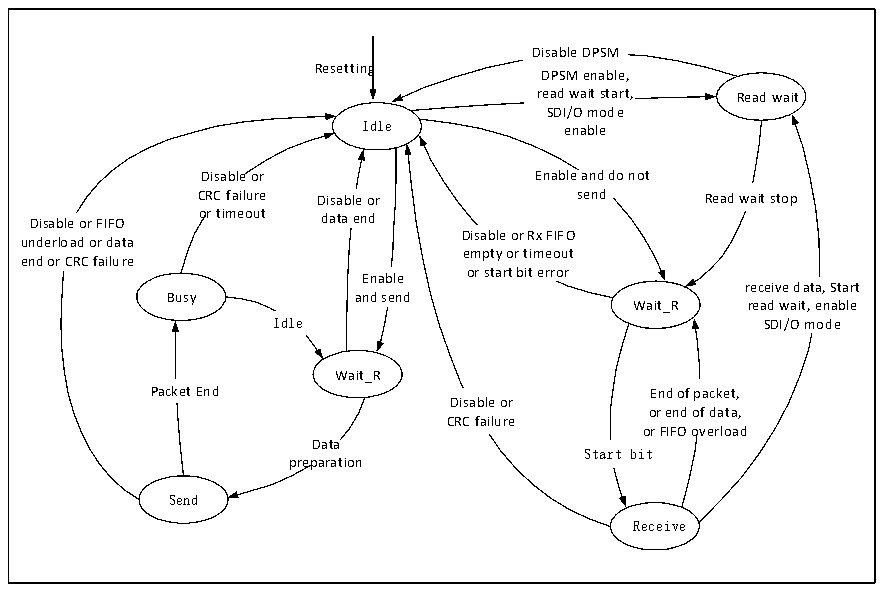

<!-- source-page: 710 -->

[← p.709](0709.md) · [index](../README.md) · [PDF p.710](https://ch32-riscv-ug.github.io/CH32H417/datasheet_en/CH32H417RM.PDF#page=710) · [p.711 →](0711.md)

<!-- header: CH32H417 Reference Manual https://wch-ic.com -->

Figure 32-3 Data path state machine  
 <!-- rendered from the PDF; verify at https://ch32-riscv-ug.github.io/CH32H417/datasheet_en/CH32H417RM.PDF#page=710 -->

🖼 Text parsed from the figure above

Disable DPSM  
Resetting DPSM enable,  
read wait start, Read wait  
SDI/O mode  
Idle enable  
Disable or Enable and do not  
CRC failure Disable or send Read wait stop  
Disable or FIFO or timeout data end  
Disable or Rx FIFO  
underload or data  
empty or timeout  
end or CRC failure  
Enable or start bit error  
receive data, Start  
Busy and send  
Wait_R read wait, enable  
Idle SDI/O mode  
Wait_R  
End of packet, or end of data, or FIFO overload  Start bi  
Packet End End of packet,  
Disable or  
CRC failure  
Data  
preparation  
Send  
Receive  

## 32.3 SDIO Protocol Description

The communication on SDIO is based on transmission as the smallest unit. Each transmission always starts with  
the host sending a command on the CMD line. After some commands are sent, the SDIO device will also send a  
piece of data on the CMD line to reply to the host, which is called &#x27;Response&#x27;, sometimes accompanied by the  
transmission of data, the transmission of data is on the D line. The format of commands and responses is fixed,  
and the definition of each field is determined according to different commands or responses. Responses and data  
transfers need to be issued or stopped within a specified time after the end of the command or response, otherwise  
a timeout error will be generated.  
The purpose of this section is to let users have a preliminary understanding of the details of some specifications  
necessary to use SDIO in a relatively small space, and it does not guarantee detailed and timely updates. The  
SDIO of the microcontroller only guarantees that it implements the hardware operation basis of the SD 2.0, SDIO  

## 2.0 and MMC 4.5 specifications, and does not necessarily support the functions defined in the higher version

specifications, such as double-edge sampling. Users should carry out SDIO interactive programming based on SD  
specification, SDIO specification and MMC specification when doing specific development.  

### 32.3.1 Bus Timing

The transmission of the SD card is initiated by the host initiating the CMD. The SD card may not reply with a  
response, but may reply with a short response and a long response, and some responses will be accompanied by  
data transmission. In the communication of the SDIO card or MMC card, there may also be a situation where the  
SDIO device actively reports an interruption. The timing is shown in the group of figures below.  
<!-- image: p710-draw-image-00001 bbox=[511.44, 786.36, 530.88, 796.68] -->
<!-- footer: V1.7 708 -->
