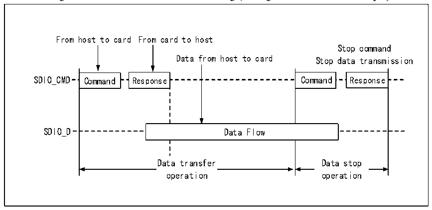
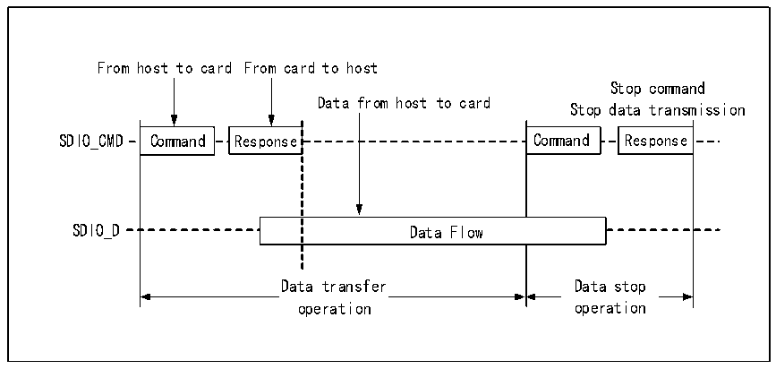

<!-- source-page: 712 -->

[← p.711](0711.md) · [index](../README.md) · [PDF p.712](https://ch32-riscv-ug.github.io/CH32H417/datasheet_en/CH32H417RM.PDF#page=712) · [p.713 →](0713.md)

<!-- header: CH32H417 Reference Manual https://wch-ic.com -->

Figure 32-7 SDIO data stream read timing (Taking SDIO card as an example)  
 <!-- rendered from the PDF; verify at https://ch32-riscv-ug.github.io/CH32H417/datasheet_en/CH32H417RM.PDF#page=712 -->

🖼 Text parsed from the figure above

From host to card From card to host  
Stop command  
Data from host to card Stop data transmission  
Command  Command  
Response  Response  
Command  Command  
Response  Response  
SDIO_CMD Command Response Command Response  
Data Flow  Data Flow  
Data transfer  operation  
Data stop  operation  
Data transfer Data stop  
operation operation  

Figure 32-8 SDIO data stream write timing (Taking SDIO card as an example)  
 <!-- rendered from the PDF; verify at https://ch32-riscv-ug.github.io/CH32H417/datasheet_en/CH32H417RM.PDF#page=712 -->

🖼 Text parsed from the figure above

From host to card From card to host  
Stop command  
Data from host to card  
Stop data transmission  
Command  Command  
Response  Command  Response  Command  Data Flow  Data Flow  
Response  Response  
Data transfer Data stop  
Data transfer  operation  
Data stop  operation  
operation operation  

### 32.3.2 Command

Most SDIO transfers start with a command (CMD), through which the SDIO host informs the device of its  
intentions. The format of the command is as follows.  

<!-- p712-table-013 (table-32-2@1) -->
<table><caption>Table 32-2 Command format</caption><tr><th style="text-align:left">Bit/Field name</th><th>Start bit</th><th style="text-align:left">Transmission bit</th><th>Command index</th><th style="text-align:left">Command parameters</th><th>CRC7</th><th>End bit</th></tr><tr><td>Rank/Width</td><td>47</td><td>46</td><td>[45:40] / 6 bits</td><td>[39:8] / 32 bits</td><td>[7:1] / 7 bits</td><td>0</td></tr><tr><td>Value</td><td>0b</td><td>1b</td><td>X</td><td>X</td><td>X</td><td>1b</td></tr></table>

4 types of commands:  
1） Broadcast command (bc): sent to all cards on the bus, no response returned;  
2） Broadcast command with response (bcr): sent to all cards on the bus, and a response is returned;  
3） Point-to-point command (ac): issued to a specific card, but no data transmission;  
4） Point-to-point command with data transmission (adtc): issued to a specific card with data transmission  
<!-- image: p712-draw-image-00001 bbox=[511.44, 786.36, 530.88, 796.68] -->
<!-- footer: V1.7 710 -->
