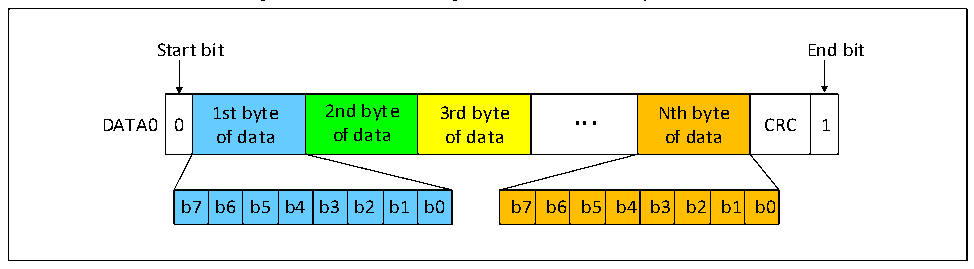
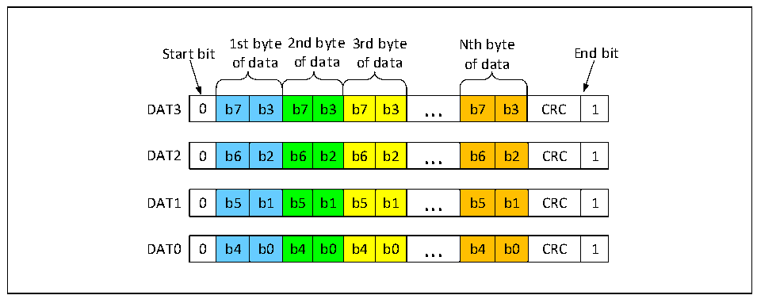
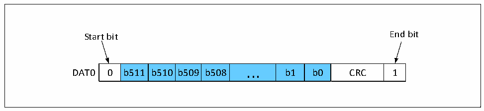

<!-- source-page: 718 -->

[← p.717](0717.md) · [index](../README.md) · [PDF p.718](https://ch32-riscv-ug.github.io/CH32H417/datasheet_en/CH32H417RM.PDF#page=718) · [p.719 →](0719.md)

<!-- header: CH32H417 Reference Manual https://wch-ic.com -->

Figure 32-9 SD card single bus data transfer byte format  
 <!-- rendered from the PDF; verify at https://ch32-riscv-ug.github.io/CH32H417/datasheet_en/CH32H417RM.PDF#page=718 -->

🖼 Text parsed from the figure above

Start bit End bit  
0  1st byte of data  2nd byte of data  3rd byte of data  ...  Nth byte of data  CRC  1  b7  b6  b5  b4  b3  b2  b1  b0  b7  b6  b5  b4  b3  b2  b1  b0  

Figure 32-10 SD card 4 bus data transfer byte  
 <!-- rendered from the PDF; verify at https://ch32-riscv-ug.github.io/CH32H417/datasheet_en/CH32H417RM.PDF#page=718 -->

format  

🖼 Text parsed from the figure above

1st byte 2nd byte 3rd byte Nth byte  
Start bit End bit  
of data of data of data of data  
0  b7  b3  b7  b3  b7  b3  ...  b7  b3  CRC  1  
0  b6  b2  b6  b2  b6  b2  ...  b6  b2  CRC  1  
0  b5  b1  b5  b1  b5  b1  ...  b5  b1  CRC  1  
0  b4  b0  b4  b0  b4  b0  ...  b4  b0  CRC  1  

Figure 32-11 SD card single bus data transfer in a 512-bit word format  
 <!-- rendered from the PDF; verify at https://ch32-riscv-ug.github.io/CH32H417/datasheet_en/CH32H417RM.PDF#page=718 -->

🖼 Text parsed from the figure above

Start bit End bit  
0  b511  b510  b509  b508  ...  b1  b0  CRC  1  

<!-- image: p718-draw-image-00001 bbox=[511.44, 786.36, 530.88, 796.68] -->
<!-- footer: V1.7 716 -->
