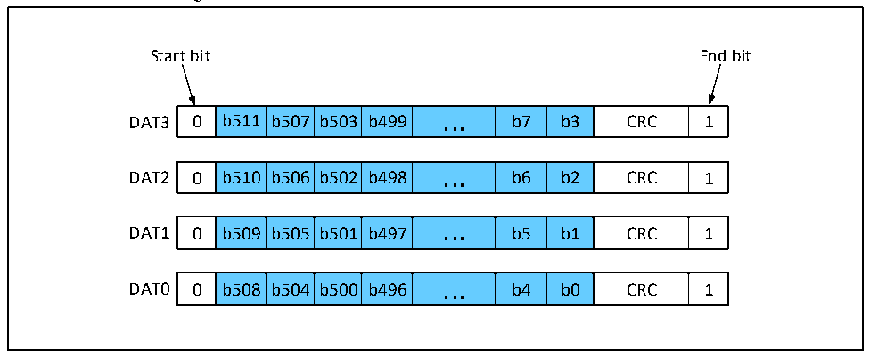

<!-- source-page: 719 -->

[← p.718](0718.md) · [index](../README.md) · [PDF p.719](https://ch32-riscv-ug.github.io/CH32H417/datasheet_en/CH32H417RM.PDF#page=719) · [p.720 →](0720.md)

<!-- header: CH32H417 Reference Manual https://wch-ic.com -->

Figure 32-12 SD card 4 bus data transfer in a 512-bit word format  
 <!-- rendered from the PDF; verify at https://ch32-riscv-ug.github.io/CH32H417/datasheet_en/CH32H417RM.PDF#page=719 -->

🖼 Text parsed from the figure above

Start bit End bit  
0  b511  b507  b503  b499  ...  b7  b3  CRC  1  
0  b510  b506  b502  b498  ...  b6  b2  CRC  1  
0  b509  b505  b501  b497  ...  b5  b1  CRC  1  
0  b508  b504  b500  b496  ...  b4  b0  CRC  1  

### 32.3.5 Slave Mode

Turning on the SLV_MODE bit means that it is in the state of waiting for commands from the host, with received  
command parameters placed in RESP1 and received command indexes placed in RESP2, while automatically  
answering to the host with an R1 type of answer, with the answer parameter being the value of CMDARG.  
Data sent and received in slave mode refer to master mode, but the slave can use the SLV_FORCE_ERR bit to  
force a data block CRC error, thus indicating an undesired data read or write.  
<em>Note: The slave supports only the R1 type of answer, and the command indexes and parameter meanings used for</em>  
<em>master-slave communication are defined by the software;</em>  

## 32.4 Application

### 32.4.1 Device Initialization and Device Registers

#### 32.4.1.1 OCR

The Operation Conditions Register stores some information about the power supply voltage and related status bits  
of the SD card. The relevant bits are defined in the following table.  

<!-- p719-table-005 (table-32-14@1) pages 719-720 -->
<table><caption>Table 32-14 OCR bit definitions</caption><tr><th>Bit</th><th>Bit definition</th><th>Description</th></tr><tr><td>[0-3]</td><td>Reserved</td><td rowspan="11" style="text-align:left">Supported V voltage range in volts. DD33</td></tr><tr><td>4</td><td>Reserved</td></tr><tr><td>5</td><td>Reserved</td></tr><tr><td>6</td><td>Reserved</td></tr><tr><td>7</td><td>Reserved for low voltage range</td></tr><tr><td>8</td><td>Reserved</td></tr><tr><td>9</td><td>Reserved</td></tr><tr><td>10</td><td>Reserved</td></tr><tr><td>11</td><td>Reserved</td></tr><tr><td>12</td><td>Reserved</td></tr><tr><td>13</td><td>Reserved</td></tr><tr><td>14</td><td>Reserved</td><td rowspan="10"></td></tr><tr><td>15</td><td>2.7-2.8</td></tr><tr><td>16</td><td>2.8-2.9</td></tr><tr><td>17</td><td>2.9-3.0</td></tr><tr><td>18</td><td>3.0-3.1</td></tr><tr><td>19</td><td>3.1-3.2</td></tr><tr><td>20</td><td>3.2-3.3</td></tr><tr><td>21</td><td>3.3-3.4</td></tr><tr><td>22</td><td>3.4-3.5</td></tr><tr><td>23</td><td>3.5-3.6</td></tr><tr><td>24</td><td>accept switching to 1.8V</td><td></td></tr><tr><td>[25:26]</td><td>Reserved</td><td></td></tr><tr><td>27</td><td>Over 2TB support status bit</td><td></td></tr><tr><td>28</td><td>Reserved</td><td></td></tr><tr><td>29</td><td>UHS-II card status bits</td><td style="text-align:left">This bit is set to indicate that the card supports the UHS-II interface.</td></tr><tr><td>30</td><td>Card capacity status (CCS)</td><td style="text-align:left">This bit is set to indicate that the card capacity is greater than 2GB.</td></tr><tr><td>31</td><td>Card power-on status bit (busy)</td><td style="text-align:left">This bit is set when the card is powered up. After power-on, other bits have meaning.</td></tr></table>

<!-- image: p719-draw-image-00001 bbox=[511.44, 786.36, 530.88, 796.68] -->
<!-- footer: V1.7 717 -->
