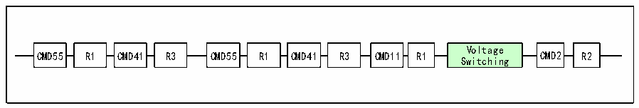

<!-- source-page: 722 -->

[← p.721](0721.md) · [index](../README.md) · [PDF p.722](https://ch32-riscv-ug.github.io/CH32H417/datasheet_en/CH32H417RM.PDF#page=722) · [p.723 →](0723.md)

<!-- header: CH32H417 Reference Manual https://wch-ic.com -->

> ⬆ **Table continued** — rendered in full at [page 720](0720.md). <!-- p722-table-001 -->

#### 32.4.1.4 RCA

The relative card address register stores the address of the card, which is 16 bits, and the default value is 0.  

### 32.4.2 Voltage Switch

In the later stage of SD card initialization, it is necessary to switch the interface level, and switch the IO level of  
the clock line, data line and command line of the SD card to the 1.8V level. For devices whose slew rate is not  
good enough, using a lower-level standard can help increase the frequency. However, the power supply voltage of  
SD does not necessarily change, and only SD cards with low voltage power supply appear in the newer version of  
the protocol.  
The steps for switching the voltage are shown in the figure below.  

Figure 32-13 Voltage switch sequence  
 <!-- rendered from the PDF; verify at https://ch32-riscv-ug.github.io/CH32H417/datasheet_en/CH32H417RM.PDF#page=722 -->

🖼 Text parsed from the figure above

Voltage  
CMD55 R1 CMD41 R3 CMD55 R1 CMD41 R3 CMD11 R1 CMD2 R2  
Switching  

### 32.4.3 Clock Switch

During initialization, the clock of the SD card is only 400KHz. After the voltage switch is completed, the clock  
can be increased to a higher level. For example, the first speed of the SDHC card UHS-I mode, the bus clock can  
reach 80MHz. In view of the IO output capability of the microcontroller, the clock should be limited to 50MHz.  

## 32.5 Interrupt

### 32.5.1 SDIO Interrupt

SDIO supports a variety of interrupt sources. As shown in the interrupt enable register (R32_SDIO_IER), there  
are 24 situations that can trigger interrupts, and users can enable them as appropriate.  

### 32.5.2 SDIO Device Interrupt

It should be noted that not only SDIO peripherals can report interrupts to the CPU, but also external SDIO cards  
<!-- image: p722-draw-image-00001 bbox=[511.44, 786.36, 530.88, 796.68] -->
<!-- footer: V1.7 720 -->
