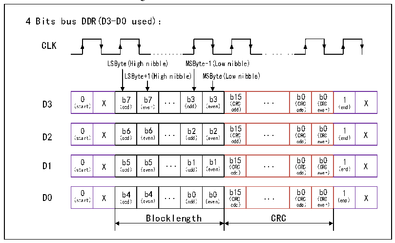
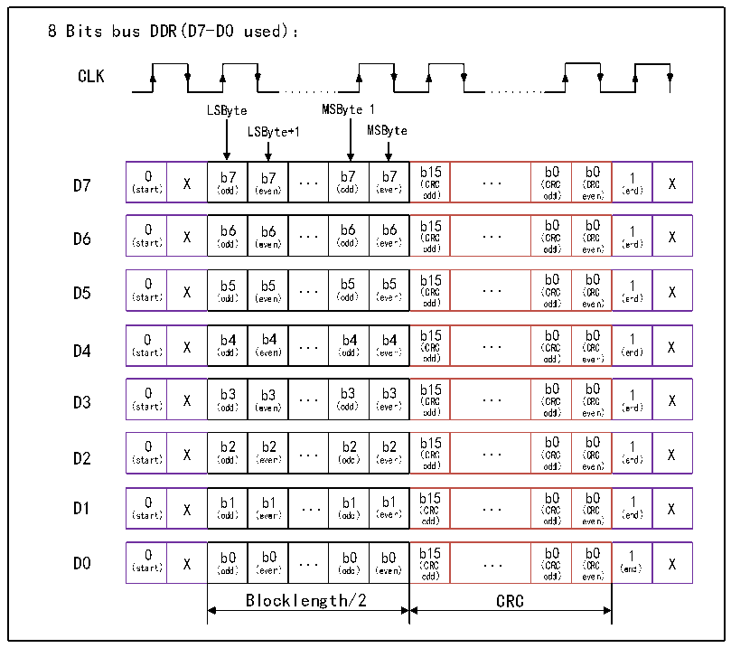

<!-- source-page: 740 -->

[← p.739](0739.md) · [index](../README.md) · [PDF p.740](https://ch32-riscv-ug.github.io/CH32H417/datasheet_en/CH32H417RM.PDF#page=740) · [p.741 →](0741.md)

<!-- header: CH32H417 Reference Manual https://wch-ic.com -->

Figure 33-1 4-wire DDR mode  
 <!-- rendered from the PDF; verify at https://ch32-riscv-ug.github.io/CH32H417/datasheet_en/CH32H417RM.PDF#page=740 -->

🖼 Text parsed from the figure above

4 Bits bus DDR(D3-D0 used)：  
CLK  
0  b7X  b7 ...  b3 b3  b15 ...  b0  b0  01  X  
0  b6X  b6 ...  b2 b2  b15 ...  b0  b0  1  X  
0  b5X  b5 ...  b1 b1  b15 ...  b0  b0  1  X  
0  b4X  b4 ...  b0 b0  b15 ...  b0  b0  1  X  CRC  

2) 8-wire DDR mode:  
That is, through the rising edge and falling edge of the clock, data is output and sampled to improve the data  
transmission rate. When applied, 8-wire mode register and DDR mode register should be enabled.  

Figure 33-2 8-wire DDR mode  
 <!-- rendered from the PDF; verify at https://ch32-riscv-ug.github.io/CH32H417/datasheet_en/CH32H417RM.PDF#page=740 -->

🖼 Text parsed from the figure above

8 Bits bus DDR(D7-D0 used)：  
CLK  
0  b7X  b7 ...  7 b7  b15 ...  b0  b0  01  X  
0  b6X  b6 ...  6 b6  b15 ...  b0  b0  01  X  
0  b5X  b5 ...  5 b5  b15 ...  b0  b0  01  X  
0  b4X  b4 ...  b4 b4  b15 ...  b0  b0  1  X  
0  b3X  b3 ...  3 b3  b15 ...  b0  b0  01  X  
0  b2X  b2 ...  b2 b2  b15 ...  b0  b0  1  X  
0  b1X  b1 ...  b1 b1  b15 ...  b0  b0  1  X  
0  b0X  b0 ...  b0 b0  b15 ...  b0  b0  1  X  CRC  

<!-- image: p740-draw-image-00001 bbox=[511.44, 786.36, 530.88, 796.68] -->
<!-- footer: V1.7 738 -->
