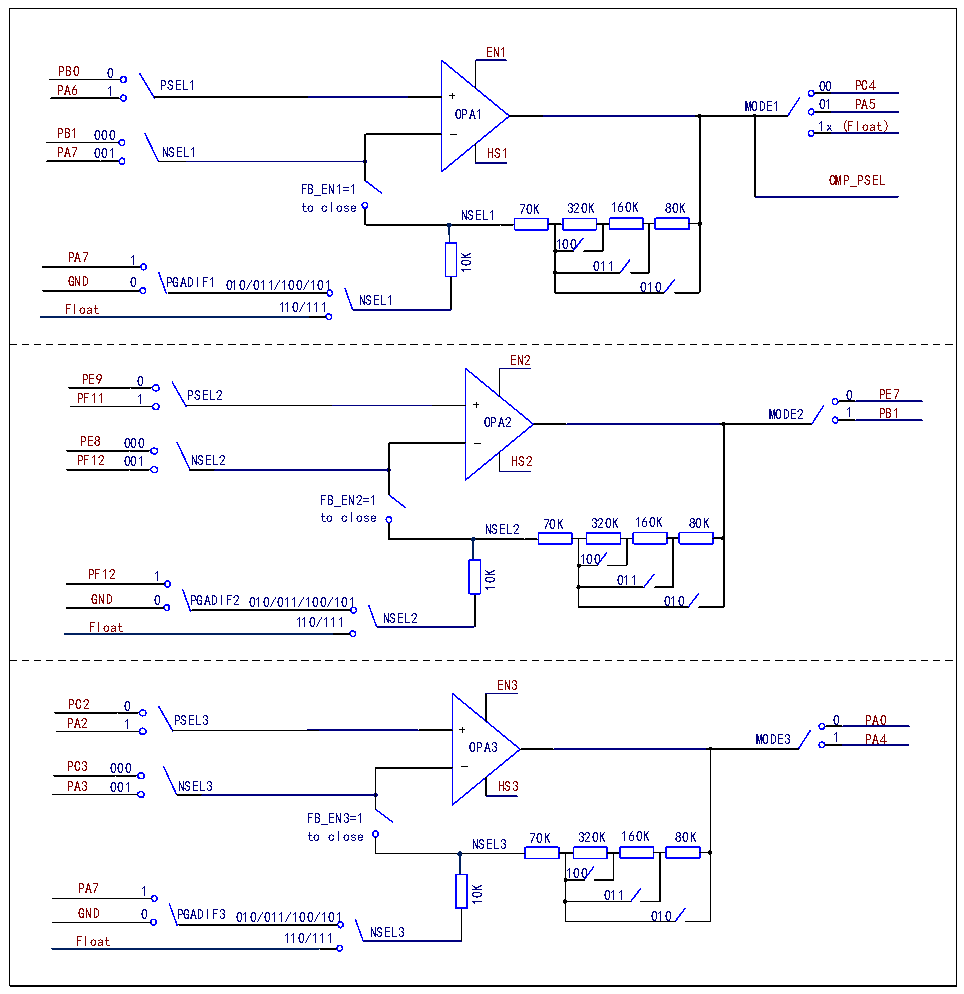

<!-- source-page: 765 -->

[← p.764](0764.md) · [index](../README.md) · [PDF p.765](https://ch32-riscv-ug.github.io/CH32H417/datasheet_en/CH32H417RM.PDF#page=765) · [p.766 →](0766.md)

<!-- header: CH32H417 Reference Manual https://wch-ic.com -->
NSEL2 set, with the N terminal connected to PF12; configure the HS2 bit to enable high-speed mode, which  
improves slew rate in this mode; configure the MODE2 bit to select the output channel.  
In the R32_OPA_CTLR3 register: Configure the EN3 bit to enable OPA3; Configure the PSEL3 bit to select the  
positive input channel for OPA3; Configure the NSEL3 bit to select the negative input channel for OPA3 or enable  
PGA mode, setting the internal gain of OPA3. Configure the FB_EN3 bit to enable OPA3&#x27;s PGA mode feedback.  
Configure the PGADIF3 bit to enable differential input PGA mode, allowing OPA3 to function as a PGA with  
NSEL3 set, with the N terminal connected to PA3. Configure the HS3 bit to enable high-speed mode, which  
improves slew rate in this mode. Configure the MODE3 bit to select the output channel.  

Figure 35-1 OPA1/OPA2/OPA3 Structure Diagram  
 <!-- rendered from the PDF; verify at https://ch32-riscv-ug.github.io/CH32H417/datasheet_en/CH32H417RM.PDF#page=765 -->

🖼 Text parsed from the figure above

EN1 PB0 0 PA6 1 PSEL1 + 00 MODE1 01OPA1 PB1 000 _ 1x (Float) PA7 001 NSEL1FB_EN1=1 to close NSEL1 PA7 1 0 PGADIF1K01PC4PA5HS1CMP_PSEL 70K 320K 160K 80K100011 GND 010/011/100/101 010NSEL1 Float 110/111  EN2 PE9 0 PF11 1 PSEL2 + 0 MODE2 1OPA2 PE8 000 _ PF12 001 NSEL2FB_EN2=1 to close NSEL2 PF12 1 0 PGADIF2K01PE7PB1HS2 70K 320K 160K 80K100011 GND 010/011/100/101 010 Float 110/111 NSEL2  EN3 PC2 0 PA2 1 PSEL3 + 0 MODE3 1OPA3 PC3 000 _ PA3 001 NSEL3FB_EN3=1 to close NSEL3 PA7 1 0 PGADIF3K01PA0PA4HS3 70K 320K 160K 80K100011 GND 010/011/100/101 010 Float 110/111 NSEL3  
10K  
10K  
10K  

<!-- image: p765-draw-image-00001 bbox=[511.44, 786.36, 530.88, 796.68] -->
<!-- footer: V1.7 763 -->
