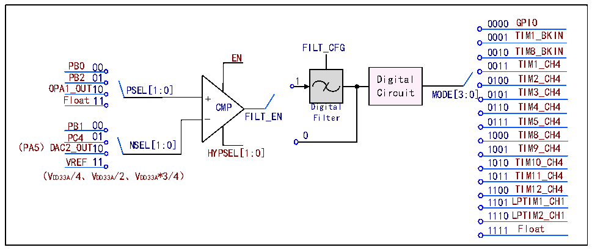

<!-- source-page: 766 -->

[← p.765](0765.md) · [index](../README.md) · [PDF p.766](https://ch32-riscv-ug.github.io/CH32H417/datasheet_en/CH32H417RM.PDF#page=766) · [p.767 →](0767.md)

<!-- header: CH32H417 Reference Manual https://wch-ic.com -->

### 35.2.2 CMP

CMP supports optional hysteresis characteristics, digital filtering at the output, and optional output filtering. The  
structure diagram is shown in Figure 35-2.  
In the R32_CMP_CTLR register: Configure the EN bit to enable the CMP module; Configure the PSEL[1:0] bits  
to select whether the P-channel is connected to a GPIO input or internally linked to the OPA operational amplifier;  
Configure the NSEL[1:0] bits to select whether the N-channel is connected to a GPIO input, internally linked to  
the DAC output, or connected to an optional internal self-bias voltage. Configure the HYPSEL bit to select the  
comparator hysteresis voltage; configure the VREF bit to select the CMP internal bias voltage magnitude;  
configure the FILT_EN bit to enable the CMP output digital filtering function; configure the FILT_CFG[8:0] bits  
to select the CMP output digital filtering sampling interval, which must be greater than the noise width and less  
than twice the noise width; Configure the FILT_BASE[2:0] bits to set the time reference for the CMP output  
digital filter sampling. Configure the MODE[3:0] bits to select whether the CMP2 output connects internally to  
the I/O or connects to the timer brake input/internal sampling channel of the timer.  
In the R32_CMP_STATR register, the output result of CMP filtering function closing/opening can be read through  
the OUT_FILT bit.  

Figure 35-2 CMP Structure Diagram  
 <!-- rendered from the PDF; verify at https://ch32-riscv-ug.github.io/CH32H417/datasheet_en/CH32H417RM.PDF#page=766 -->

🖼 Text parsed from the figure above

0000 GPIO  
0001 TIM1_BKIN  
FILT_CFG 0010 TIM8_BKIN  
EN  
PB0 00 0011 TIM1_CH4  
PB2 01 1 Digital 0100 TIM2_CH4  
OPA1_OUT10 PSEL[1:0] Circuit MODE[3:0] 0101 TIM3_CH4  
Float11 +  
CMP Digital 0110 TIM4_CH4  
PB1 00 _ FILT_EN Filter 0111 TIM5_CH4  
PC4 01 0 1000 TIM8_CH4  
（PA5）DAC2_OUT10 NSEL[1:0] HYPSEL[1:0] 1001 TIM9_CH4  
VREF 11 1010 TIM10_CH4  
（VDD33A/4、VDD33A/2、VDD33A*3/4） 1011 TIM11_CH4  
1100 TIM12_CH4  
1101LPTIM1_CH1  
1110LPTIM2_CH1  
1111 Float  

## 35.3 Register Description

<!-- p766-table-001 (table-35-4@1) -->
<table><caption>Table 35-4 OPA-related registers</caption><tr><th>Name</th><th>Access address</th><th>Description</th><th>Reset value</th></tr><tr><td>R32_OPA_CTLR1</td><td>0x40017800</td><td>OPA control register 1</td><td>0x00000076</td></tr><tr><td>R32_OPA_CTLR2</td><td>0x40017804</td><td>OPA control register 2</td><td>0x00000070</td></tr><tr><td>R32_OPA_CTLR3</td><td>0x40017808</td><td>OPA control register 3</td><td>0x00000070</td></tr><tr><td>R32_CMP_CTLR</td><td>0x4001780C</td><td>CMP control register</td><td>0x000000FF</td></tr><tr><td>R32_CMP_STATR</td><td>0x40017810</td><td>CMP status register</td><td>0x00000000</td></tr></table>

### 35.3.1 OPA Control Register 1 (R32_OPA_CTLR1)

Offset address: 0x00  
<!-- image: p766-draw-image-00001 bbox=[511.44, 786.36, 530.88, 796.68] -->
<!-- footer: V1.7 764 -->
