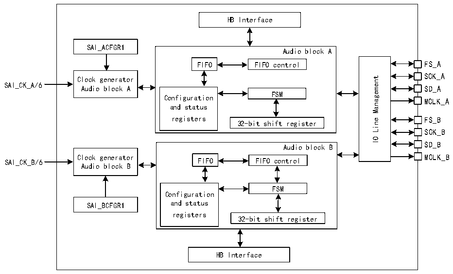

<!-- source-page: 773 -->

[← p.772](0772.md) · [index](../README.md) · [PDF p.773](https://ch32-riscv-ug.github.io/CH32H417/datasheet_en/CH32H417RM.PDF#page=773) · [p.774 →](0774.md)

<!-- header: CH32H417 Reference Manual https://wch-ic.com -->

## 36.2 Overview

Figure 36-1 Structural block diagram of SAI  
 <!-- rendered from the PDF; verify at https://ch32-riscv-ug.github.io/CH32H417/datasheet_en/CH32H417RM.PDF#page=773 -->

🖼 Text parsed from the figure above

HB Interface  
SAI_ACFGR1  
Audio block A  
FIFO FIFO control FS_A  
SCK_A  
Management  
Clock generator  
SAI_CK_A/6  
SD_A  
Audio block A  
FSM  
Configuration  
MCLK_A  
and status  
registers 32-bit shift register  
FS_B  
Line  
SCK_B  
IO  
SD_B  
Audio block B  
Clock generator MCLK_B  
FIFO FIFO control  
SAI_CK_B/6  
Audio block B  
FSM  
Configuration  
SAI_BCFGR1 and status  
registers  
32-bit shift register  
HB Interface  

The SAI primarily consists of 2 independent audio submodules connected to the output via an I/O management  
module. The I/O line controller manages four dedicated pins (SD, SCK, FS, MCLK) for the specified audio  
module within the SAI. If both submodules are declared as synchronous modules, certain pins can be shared,  
freeing others for use as general-purpose I/O. Whether the MCLK pin can function as an output pin depends on  
the specific application and decoding requirements, as well as whether the audio module is configured in master  
mode.  
Each audio module integrates a 32-bit shift register controlled by the module&#x27;s own functional state machine. Data  
storage and retrieval are performed via dedicated FIFOs. These FIFOs can be accessed by the CPU or via DMA to  
reduce the CPU&#x27;s communication load.  
The audio submodule can function as either a transmitter or receiver in both master and slave modes. Master  
mode indicates that the SAI generates the SCK bit clock and frame synchronizing signal, while slave mode  
indicates that the SCK bit clock and frame synchronizing signal originate from another external or internal master  
device. In specific cases, the direction of the FS signal is not directly related to the master or slave mode definition.  
Within the AC&#x27;97 protocol, even when the SAI (link controller) is configured to consume the SCK clock, the FS  
signal remains an SAI output (this also applies in slave mode).  

## 36.3 Function Description

### 36.3.1 Clock Generator

Both independent audio submodules of the SAI have their own clock generators, but these clock generators  
function identically.  
<!-- image: p773-draw-image-00001 bbox=[511.44, 786.36, 530.88, 796.68] -->
<!-- footer: V1.7 771 -->
