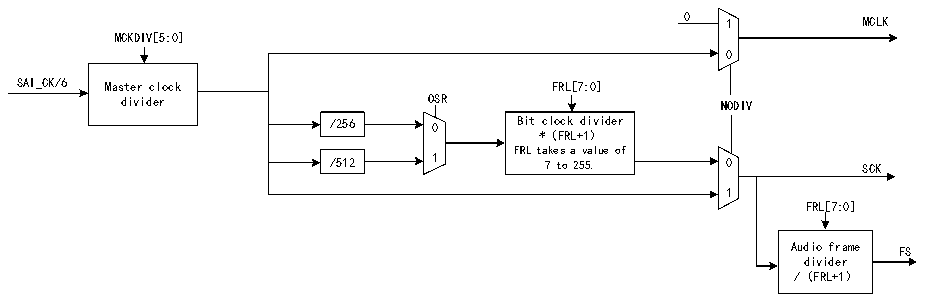

<!-- source-page: 774 -->

[← p.773](0773.md) · [index](../README.md) · [PDF p.774](https://ch32-riscv-ug.github.io/CH32H417/datasheet_en/CH32H417RM.PDF#page=774) · [p.775 →](0775.md)

<!-- header: CH32H417 Reference Manual https://wch-ic.com -->
When the audio module is configured in master mode, the clock generator provides the bit clock (SCK) and the  
master clock (MCLK) for the external decoder. When the audio module is defined as slave mode, the clock  
generator is disabled.  
The bit clock strobe edge on SCK can be configured via the CKSTR bit in the R32_SAI_xCFGR1 register. This  
bit applies to both master and slave modes.  
It is recommended to select the PLL output of 295MHz as the input clock for the SAI.  
The architecture of the audio module clock generator is shown in Figure 36-2.  

Figure 36-2 Architecture of clock generator for audio module  
 <!-- rendered from the PDF; verify at https://ch32-riscv-ug.github.io/CH32H417/datasheet_en/CH32H417RM.PDF#page=774 -->

🖼 Text parsed from the figure above

0 1 MCLK  
MCKDIV[5:0]  
0  
SAI_CK/6 Master clock FRL[7:0]  
divider OSR NODIV  
/256 0 Bit clock divider  
*（FRL+1）  
FRL takes a value of  
/512 1 7 to 255. 0 SCK  
1  
FRL[7:0]  
Audio frame FS  
divider  
/（FRL+1）  

<em>Note: When NODIV is set to 1, if the MCLK pin is configured as the SAI pin in the GPIO peripheral, its signal</em>  
<em>level will be set to 0.</em>  
The clock source of the clock generator comes from the product clock controller. SAI_CK_x clock is equivalent to  
the master clock, and can divide the frequency for the external decoder through MCKDIV[5:0] bits:  
If MCKDIV[5:0] is not equal to 0000b, then MCLK_x = SAI_CK_x / (MCKDIV[5:0] * 2)  
If MCKDIV[5:0] is equal to 0000b, then MCLK_x = SAI_CK_x  
The MCLK signal is used only in TDM.  
Frequency division must be uniform to maintain a 50% duty cycle on both the MCLK output and the SCK clock.  
If the MCKDIV[5:0] bits are set to 0000b, a single division ratio is used to make MCLK equal to SAI_CK_x.  
In the SAI, a single ratio MCLK/FS = 256 is used. In most cases, three frequency ranges will be encountered, as  
shown in Table 36-1.  

<!-- p774-table-001 (table-36-1@1) -->
<table><caption>Table 36-1 Examples of possible audio sampling range</caption><tr><th>Input SAI_CK_x clock frequency</th><th style="text-align:left">Available common audio sampling frequencies</th><th>MCKDIV[5:0]</th></tr><tr><td rowspan="5">192kHz * 256</td><td>192kHz</td><td>000000</td></tr><tr><td>96kHz</td><td>000001</td></tr><tr><td>48kHz</td><td>000010</td></tr><tr><td>16kHz</td><td>000110</td></tr><tr><td>8kHz</td><td>001100</td></tr><tr><td rowspan="3">44.1kHz * 256</td><td>44.1kHz</td><td>000000</td></tr><tr><td>22.05kHz</td><td>000001</td></tr><tr><td>11.025kHz</td><td>000010</td></tr><tr><td>SAI_CK_x = MCLK</td><td>MCLK</td><td>000000</td></tr></table>

<em>Note: This happens when the product clock controller selects an external clock source instead of the PLL clock.</em>  
<!-- image: p774-draw-image-00001 bbox=[511.44, 786.36, 530.88, 796.68] -->
<!-- footer: V1.7 772 -->
