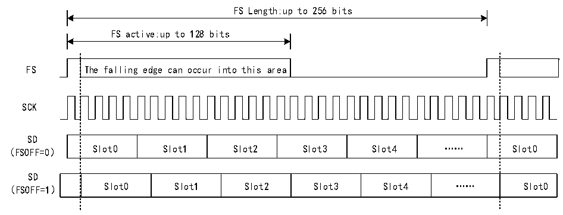

<!-- source-page: 776 -->

[← p.775](0775.md) · [index](../README.md) · [PDF p.776](https://ch32-riscv-ug.github.io/CH32H417/datasheet_en/CH32H417RM.PDF#page=776) · [p.777 →](0777.md)

<!-- header: CH32H417 Reference Manual https://wch-ic.com -->
<strong>Slave mode</strong>  
In slave mode, the SAI receives clock signals from external devices:  
1) When the SAI submodule is configured for asynchronous mode, the SCK and FS pins are configured as inputs.  
2) If the SAI submodule is configured to operate synchronously with the second audio submodule, the  
corresponding SCK and FS pins are released for use as general-purpose I/O.  
In slave mode, the MCLK pin is not used and can be assigned to other functions. It is recommended to enable the  
slave device before enabling the master device.  

### 36.3.3 Internal Synchronization Mode

The audio submodule can run synchronously with another audio submodule in the same SAI, which is also called  
internal synchronization mode. In this case, they will share the bit clock and frame synchronization signal to  
reduce the number of external pins occupied during communication. An audio module configured in synchronous  
mode will release its SCK, FS and MCLK pins to be used as GPIO, while an audio module configured in  
asynchronous mode will use its SCK, FS and MCLKI/O pins (if the audio module is configured as a master  
module).  
Typically, the audio module in synchronous mode can be used to configure the SAI in full-duplex mode. One of  
the two audio modules can be configured as the master module and the other as the slave module; alternatively,  
both can be configured as slave modules. One module can be set as the asynchronous module (with the  
SYNCEN[1:0] bits in the R32_SAI_xCFGR1 register set to 00b), and the other as the synchronous module (with  
the SYNCEN[1:0] bits in the R32_SAI_xCFGR1 register set to 01b).  
<em>Note: Due to the internal resynchronization phase, the HCLK frequency must be greater than twice the bit rate</em>  
<em>clock frequency.</em>  

### 36.3.4 Frame Configuration

#### 36.3.4.1 Frame Synchronization

The FS signal is used as a frame synchronization signal (SOF) in audio. The waveform of this signal can be  
completely configurable by configuring R32_SAI_xFRCR register, which can support various audio protocols  
with special specifications during frame synchronization. The following figure shows the configurability of audio  
frames.  

Figure 36-3 Audio frame  
 <!-- rendered from the PDF; verify at https://ch32-riscv-ug.github.io/CH32H417/datasheet_en/CH32H417RM.PDF#page=776 -->

🖼 Text parsed from the figure above

FS Length:up to 256 bits  
FS active:up to 128 bits  
FS The falling edge can occur into this area  
SCK  
SD  
Slot0  Slot1  Slot2  Slot3  Slot4  ……  Slot0  
SD  
Slot0  Slot1  Slot2  Slot3  Slot4  ……  Slot0  
（FSOFF=1）  

<!-- image: p776-draw-image-00001 bbox=[511.44, 786.36, 530.88, 796.68] -->
<!-- footer: V1.7 774 -->
