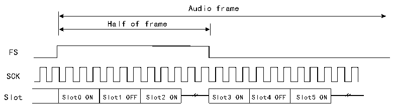

<!-- source-page: 778 -->

[← p.777](0777.md) · [index](../README.md) · [PDF p.778](https://ch32-riscv-ug.github.io/CH32H417/datasheet_en/CH32H417RM.PDF#page=778) · [p.779 →](0779.md)

<!-- header: CH32H417 Reference Manual https://wch-ic.com -->
According to the audio protocols supported in the application (such as I2S standard protocol and MSB alignment  
protocol), setting the audio frame synchronization offset can make the frame synchronization signal valid when  
the last bit or the first bit is transmitted. You can select one of two configurations by using the FSOFF bit in the  
R32_SAI_xFRCR register.  

#### 36.3.4.6 Function of FS Signal

The meaning of FS signal varies with the function of FS, and the meaning of FS signal can be configured in the  
FSDEF bit of R32_SAI_xFRCR register.  
- When the FSDEF bit is set to 1, the FS signal simultaneously carries both the SOF signal and channel
identification signal within the frame, suitable for audio frame structures such as I2S, MSB-aligned, or  
LSB-aligned protocols;  
- When the FSDEF bit is set to 0, the FS signal functions as the SOF signal, suitable for PCM/DSP, TDM, AC&#x27;97,
and audio protocols.  
When interpreting the FS signal as the SOF signal and channel identification signal within a frame, the declared  
number of slots should be evenly distributed between the left and right channels. If the number of bit clock cycles  
on a half audio frame exceeds the dedicated slot count for a channel and the TRIS bit is set to 0, the remaining bit  
clock cycles in the R32_SAI_xCFGR2 register will output 0. Conversely, if the TRIS bit is set to 1, the SD line  
will enter a high-impedance state. During reception, the remaining bit clock cycles are only considered when a  
channel change occurs.  

Figure 36-4 FS is used for SOF signal+channel identification signal  
 <!-- rendered from the PDF; verify at https://ch32-riscv-ug.github.io/CH32H417/datasheet_en/CH32H417RM.PDF#page=778 -->

Number of slots not aligned with the audio frame  

🖼 Text parsed from the figure above

Audio frame  
Half of frame  
FS  
SCK  
Slot0 ON  Slot1 OFF  Slot2 ON  
Slot3 ON  Slot4 OFF  Slot5 ON  

Number of slots aligned with the audio frame  
Audio frame  
Half of frame  
FS  
SCK  

<!-- p778-table-003 (table-36-1@1) -->
<table><tr><th>Slot0</th><th>Slot1</th><th>Slot2</th><th>Slot3</th><th>Slot4</th><th>Slot5</th></tr></table>

Slot  
<em>Note: The frame length should be even.</em>  
If the FSDEF bit in the R32_SAI_xFRCR register remains cleared, the FS signal is equivalent to the SOF signal.  
If the result of multiplying the number of slots defined by the NBSLOT[3:0] bits in the R32_SAI_xSLOTR  
register by the number of slots configured in the SLOTSZ[1:0] bits of the R32_SAI_xSLOTR register is less than  
the frame size (as indicated by the FRL[7:0] bits in the R32_SAI_xFRCR register), then: is less than the frame  
size (R32_SAI_xFRCR register FRL[7:0] bits), then:  
<!-- image: p778-draw-image-00001 bbox=[511.44, 786.36, 530.88, 796.68] -->
<!-- footer: V1.7 776 -->
