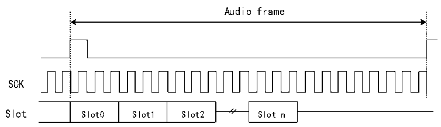

<!-- source-page: 779 -->

[← p.778](0778.md) · [index](../README.md) · [PDF p.779](https://ch32-riscv-ug.github.io/CH32H417/datasheet_en/CH32H417RM.PDF#page=779) · [p.780 →](0780.md)

<!-- header: CH32H417 Reference Manual https://wch-ic.com -->
If the TRIS bit in the R32_SAI_xCFGR2 register is set to 0, the remaining bits after the last Slot will be forced to  
0 until the transmitter frame terminates.  
If the TRIS bit in the R32_SAI_xCFGR2 register is set to 1, the data lines are released to high-impedance state  
during transmission of these remaining bits. In receive mode, these bits are discarded.  

Figure 36-5 FS is used for SOF signal  
 <!-- rendered from the PDF; verify at https://ch32-riscv-ug.github.io/CH32H417/datasheet_en/CH32H417RM.PDF#page=779 -->

🖼 Text parsed from the figure above

Audio frame  
SCK  
Slot0  Slot1  Slot2  

Data =0 after slot n if TRIS = 0  
SD output released （HI-Z）after slot n if TRIS =1  
In transmit mode, when the audio module is configured to capture SPDIF output on the SD line, the FS signal will  
not be utilized. The corresponding FS I/O will be released for other purposes.  

### 36.3.5 Slot Configuration

The basic unit of an audio frame is a Slot, with each audio frame capable of being divided into up to 16 Slots. The  
number of Slots within an audio frame is determined by NBSLOT[3:0]+1.  
For AC&#x27;97 or SPDIF protocols (when PRTCFG[1:0] bits are set to 10b or 01b), the number of Slots is  
automatically configured according to the respective protocol specifications, and the value of NBSLOT[3:0] is  
ignored.  
By setting the SLOTEN[15:0] bits in the R32_SAI_xSLOTR register, individual slots can be enabled or disabled.  
When transmitting an invalid slot, the SD data line is forcibly set to 0 or placed in a high-impedance state,  
depending on the configuration of the TRIS bit in transmit mode (see the section on invalid slot output data line  
management for details). In receive mode, data received after the end of this invalid slot is ignored. Consequently,  
there are no FIFO accesses, nor any FIFO read/write requests associated with the state of this invalid slot.  
Additionally, the slot size can be selected by setting bits SLOTSZ[1:0] in the R32_SAI_xSLOTR register to 1, as  
shown in Figure 36-6.  
<!-- image: p779-draw-image-00001 bbox=[511.44, 786.36, 530.88, 796.68] -->
<!-- footer: V1.7 777 -->
