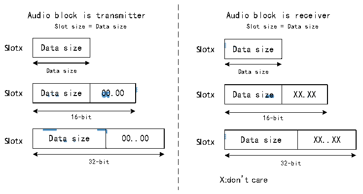
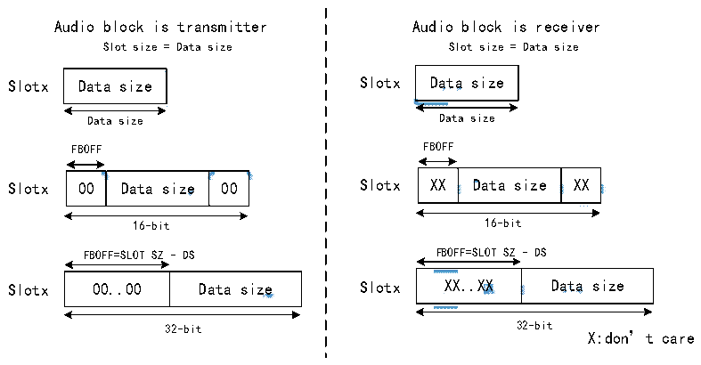

<!-- source-page: 780 -->

[← p.779](0779.md) · [index](../README.md) · [PDF p.780](https://ch32-riscv-ug.github.io/CH32H417/datasheet_en/CH32H417RM.PDF#page=780) · [p.781 →](0781.md)

<!-- header: CH32H417 Reference Manual https://wch-ic.com -->

Figure 36-6 Slot size configuration when FBOFF bit 0  
 <!-- rendered from the PDF; verify at https://ch32-riscv-ug.github.io/CH32H417/datasheet_en/CH32H417RM.PDF#page=780 -->

🖼 Text parsed from the figure above

Audio block is transmitter Audio block is receiver  
Slot size = Data size Slot size = Data size  
<!-- image: p780-draw-image-00002 inside the figure -->
<!-- image: p780-draw-image-00012 inside the figure -->
<!-- image: p780-draw-image-00003 inside the figure -->
<!-- image: p780-draw-image-00013 inside the figure -->
Slotx Data size Slotx Data size  
Data size Data size  
<!-- image: p780-draw-image-00006 inside the figure -->
<!-- image: p780-draw-image-00004 inside the figure -->
<!-- image: p780-draw-image-00016 inside the figure -->
<!-- image: p780-draw-image-00014 inside the figure -->
<!-- image: p780-draw-image-00007 inside the figure -->
<!-- image: p780-draw-image-00005 inside the figure -->
Data size  00.00  
Data size  XX.XX  
<!-- image: p780-draw-image-00017 inside the figure -->
<!-- image: p780-draw-image-00015 inside the figure -->
Slotx Data size 00.00 Slotx Data size XX.XX  
16-bit 16-bit  
<!-- image: p780-draw-image-00010 inside the figure -->
<!-- image: p780-draw-image-00008 inside the figure -->
<!-- image: p780-draw-image-00020 inside the figure -->
<!-- image: p780-draw-image-00018 inside the figure -->
Data size  0.0  
Data size  X.X  
<!-- image: p780-draw-image-00011 inside the figure -->
<!-- image: p780-draw-image-00009 inside the figure -->
<!-- image: p780-draw-image-00021 inside the figure -->
<!-- image: p780-draw-image-00019 inside the figure -->
Slotx Data size 00..00 Slotx Data size XX..XX  
32-bit 32-bit  
X:don’t care  

The position of the first data bit to be transmitted within the slot, i.e., the offset value of the first bit, can be  
configured via the FBOFF[4:0] bits of the R32_SAI_xSLOTR register. As shown in Figure 36-7, in transmit mode,  
a value of 0 is injected starting from the Slot&#x27;s beginning position until the preset offset position is reached. In  
receive mode, bits within the offset phase are ignored. This feature applies to LSB-aligned protocols (if the offset  
equals the Slot size minus the data size).  

Figure 36-7 First bit offset  
 <!-- rendered from the PDF; verify at https://ch32-riscv-ug.github.io/CH32H417/datasheet_en/CH32H417RM.PDF#page=780 -->

🖼 Text parsed from the figure above

Audio block is transmitter Audio block is receiver  
Slot size = Data size Slot size = Data size  
<!-- image: p780-draw-image-00034 inside the figure -->
<!-- image: p780-draw-image-00022 inside the figure -->
<!-- image: p780-draw-image-00035 inside the figure -->
<!-- image: p780-draw-image-00023 inside the figure -->
Slotx Data size Slotx Data size  
Data size Data size  
FBOFF FBOFF  
<!-- image: p780-draw-image-00044 inside the figure -->
<!-- image: p780-draw-image-00038 inside the figure -->
<!-- image: p780-draw-image-00036 inside the figure -->
<!-- image: p780-draw-image-00032 inside the figure -->
<!-- image: p780-draw-image-00026 inside the figure -->
<!-- image: p780-draw-image-00024 inside the figure -->
00  Data size  00  
XX  Data size  XX  
<!-- image: p780-draw-image-00045 inside the figure -->
<!-- image: p780-draw-image-00039 inside the figure -->
<!-- image: p780-draw-image-00037 inside the figure -->
<!-- image: p780-draw-image-00033 inside the figure -->
<!-- image: p780-draw-image-00027 inside the figure -->
<!-- image: p780-draw-image-00025 inside the figure -->
Slotx 00 Data size 00 Slotx XX Data size XX  
16-bit 16-bit  
FBOFF=SLOT SZ - DS FBOFF=SLOT SZ - DS  
<!-- image: p780-draw-image-00040 inside the figure -->
<!-- image: p780-draw-image-00042 inside the figure -->
0.0  Data size  
X.X  Data size  
<!-- image: p780-draw-image-00028 inside the figure -->
<!-- image: p780-draw-image-00030 inside the figure -->
<!-- image: p780-draw-image-00041 inside the figure -->
<!-- image: p780-draw-image-00043 inside the figure -->
<!-- image: p780-draw-image-00029 inside the figure -->
<!-- image: p780-draw-image-00031 inside the figure -->
Slotx 00..00 Data size Slotx XX..XX Data size  
32-bit 32-bit  
X:don’t care  

To avoid SAI malfunction, the following conditions must be met:  
FBOFF ≤ (SLOTSZ - DS),  
DS ≤ SLOTSZ,  
NBSLOT × SLOTSZ ≤ FRL (Frame Length),  
When bit 1 of the R32_SAI_xFRCR register&#x27;s FSDEF field is set, the number of slots must be even.  
In AC&#x27;97 and SPDIF protocols (PRTCFG[1:0] bits set to 10b or 01b), slot size is automatically configured  
according to Section 36.3.7: AC&#x27;97 Link Controller.  
<!-- image: p780-draw-image-00001 bbox=[511.44, 786.36, 530.88, 796.68] -->
<!-- footer: V1.7 778 -->
