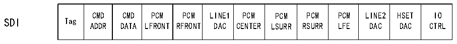

<!-- source-page: 783 -->

[← p.782](0782.md) · [index](../README.md) · [PDF p.783](https://ch32-riscv-ug.github.io/CH32H417/datasheet_en/CH32H417RM.PDF#page=783) · [p.784 →](0784.md)

<!-- header: CH32H417 Reference Manual https://wch-ic.com -->
R32_SAI_xSR register are less than 101b), this interrupt (the FREQ bit in the R32_SAI_xSR register) is cleared  
by hardware.  
<em>Note: Similar to interrupt generation, if the DMAEN bit in the R32_SAI_xCFGR1 register is set to 1, the SAI can</em>  
<em>utilize DMA.</em>  

### 36.3.7 AC&#x27;97 Link Controller

SAI can function as an AC&#x27;97 link controller. This mode is configured via the PRTCFG[1:0] bits in the  
R32_SAI_xCFGR1 register. When this protocol is selected, numerous configuration fields are ignored.  
Consequently, the number of slots and slot size are fixed, and the frame synchronization signal must be fully  
defined with a fixed waveform. Failure to meet these requirements will prevent SAI from operating correctly.  
The NBSLOT[3:0] bits and SLOTSZ[1:0] bits will be ignored;  
- The number of slots is fixed at 13. The first slot is 16 bits wide, while all other slots are 20 bits wide (data slots);
- The FBOFF[4:0] bits in the SAI_xSLOTR register are ignored;
- The SAI_xFRCR register is ignored;
- MCLK is not used.
Regardless of whether the master or slave configuration is adopted, since the AC&#x27;97 link controller drives the FS  
signal, the FS signal generated by the asynchronous module will be automatically configured as an output.  

Figure 36-8 AC&#x27;97 audio frame  
 <!-- rendered from the PDF; verify at https://ch32-riscv-ug.github.io/CH32H417/datasheet_en/CH32H417RM.PDF#page=783 -->

FS  
1 2 3 4 5 6 7 8 9 10 11 12  

🖼 Text parsed from the figure above

Tag  CMDADDR  CMDDATA  PCMLFRONT  PCMRFRONT  LINE1DAC  PCMCENTER  PCMLSURR  PCMRSURR  PCMLFE  LINE2DAC  HSETDAC  IOCTRL  
SDI Tag  

<!-- p783-table-002 (table-36-2@1) -->
<table><tr><th>Tag</th><th style="text-align:left">STATUSADDR</th><th style="text-align:left">STATUSDATA</th><th style="text-align:left">PCMLEFT</th><th style="text-align:left">PCMRIGTH</th><th style="text-align:left">LINE1ADC</th><th style="text-align:left">PCMMIC</th><th style="text-align:left">RSRVD</th><th style="text-align:left">RSRVD</th><th style="text-align:left">RSRLVD</th><th style="text-align:left">LINE2ADC</th><th>HSET</th><th style="text-align:left">IOSTATUS</th></tr></table>

<em>Note: In the AC&#x27;97 protocol, bit 2 of the TAG is reserved (always set to 0). Therefore, regardless of the value</em>  
<em>written to the SAI FIFO, bit 2 of the TAG is forced to 0. For detailed information on TAG representation, refer to</em>  
<em>the AC&#x27;97 protocol standard.</em>  
One SAI can be used for AC&#x27;97 point-to-point communication, as shown in Figure 36-9. In SAI, audio module A  
must be declared as an asynchronous master transmitter, while audio module B must be defined as a slave receiver  
and synchronized with audio module A internally.  
<!-- image: p783-draw-image-00001 bbox=[511.44, 786.36, 530.88, 796.68] -->
<!-- footer: V1.7 781 -->
