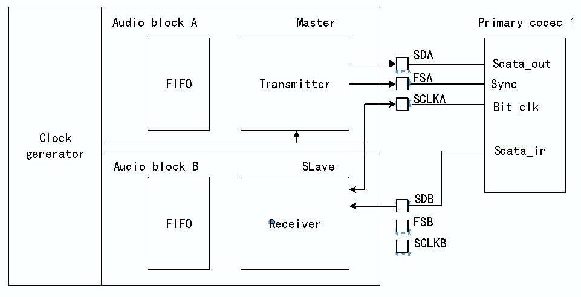

<!-- source-page: 784 -->

[← p.783](0783.md) · [index](../README.md) · [PDF p.784](https://ch32-riscv-ug.github.io/CH32H417/datasheet_en/CH32H417RM.PDF#page=784) · [p.785 →](0785.md)

<!-- header: CH32H417 Reference Manual https://wch-ic.com -->

Figure 36-9 SAI for AC&#x27;97 point-to-point communication  
 <!-- rendered from the PDF; verify at https://ch32-riscv-ug.github.io/CH32H417/datasheet_en/CH32H417RM.PDF#page=784 -->

🖼 Text parsed from the figure above

<!-- image: p784-draw-image-00010 inside the figure -->
Clock generator  Audio block A Master FIFO Transmitter  Audio block B SLave FIFO Receiver  
<!-- image: p784-draw-image-00002 inside the figure -->
<!-- image: p784-draw-image-00004 inside the figure -->
<!-- image: p784-draw-image-00017 inside the figure -->
<!-- image: p784-draw-image-00011 inside the figure -->
SDA  
<!-- image: p784-draw-image-00021 inside the figure -->
Sdata_out  
FSA  
<!-- image: p784-draw-image-00003 inside the figure -->
<!-- image: p784-draw-image-00005 inside the figure -->
<!-- image: p784-draw-image-00022 inside the figure -->
<!-- image: p784-draw-image-00012 inside the figure -->
SCLKA  
<!-- image: p784-draw-image-00023 inside the figure -->
Bit_clk  
<!-- image: p784-draw-image-00013 inside the figure -->
<!-- image: p784-draw-image-00014 inside the figure -->
<!-- image: p784-draw-image-00006 inside the figure -->
<!-- image: p784-draw-image-00008 inside the figure -->
SDB  
<!-- image: p784-draw-image-00018 inside the figure -->
<!-- image: p784-draw-image-00007 inside the figure -->
<!-- image: p784-draw-image-00009 inside the figure -->
<!-- image: p784-draw-image-00015 inside the figure -->
<!-- image: p784-draw-image-00019 inside the figure -->
SCLKB  
<!-- image: p784-draw-image-00020 inside the figure -->
<!-- image: p784-draw-image-00016 inside the figure -->

In receiver mode, SAI, which is used as AC&#x27;97 link controller, does not need FIFO request, so when the codec  
ready bit in Slot0 is decoded to low level, no data is stored in FIFO. If the CNRDYIE bit in the  
R32_SAI_xINTENR register is enabled, the flag CNRDY in the R32_SAI_xSR register will be set to 1 and an  
interrupt will be generated. This flag is dedicated to AC&#x27;97 protocol.  
<strong>Clock generator programming in AC&#x27;97 mode</strong>  
In AC&#x27;97 mode, the frame length is fixed at 256 bits, and its frequency should be set to 48 kHz. The rules  
specified in Section 36.3.1: SAI Clock Generator should be applied with FRL=255 to generate the appropriate  
frame rate (FFS).  

### 36.3.8 SPDIF Output

SPDIF (Sony/Philips Digital Interface) is a digital audio interconnect for consumer audio equipment, designed to  
transmit audio over reasonably short distances. The SPDIF interface is available only in transmit mode and  
supports the IEC 60958 standard. SPDIF mode can be selected by setting the PRTCFG[1:0] bits in the  
R32_SAI_xCFGR1 register to 01b.  
For the SPDIF protocol:  
1) Enable only the SD data line;  
2) Release the FS, SCK, and MCLK I/O pins;  
3) To enable the SAI clock generator and manage the data rate on the SD line, force the MODE[1] bit to 0 to  
select master mode;  
4) Force the data size to 24 bits. Values set in DS[2:0] bits of the R32_SAI_xCFGR1 register are ignored;  
5) The clock generator must be configured to define the symbol rate, where the known-bit clock should be twice  
the symbol rate. Data is encoded using the Manchester protocol;  
6) Ignore the SAI_xFRCR and SAI_xSLOTR registers. Internally configure the SAI to comply with SPDIF  
protocol requirements, as shown in Figure 36-0.  
<!-- image: p784-draw-image-00001 bbox=[511.44, 786.36, 530.88, 796.68] -->
<!-- footer: V1.7 782 -->
