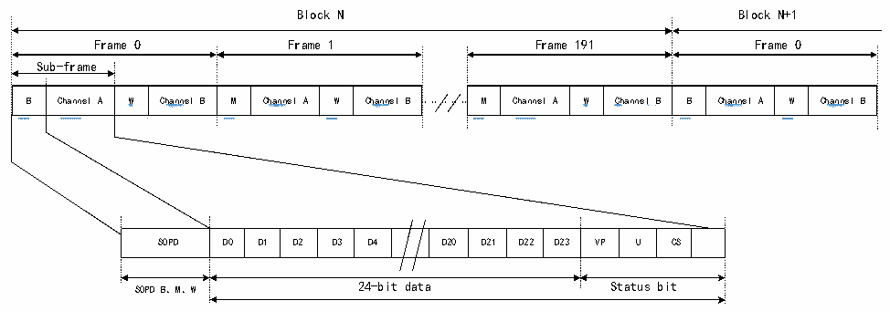
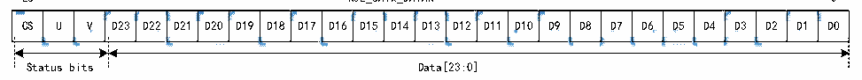

<!-- source-page: 785 -->

[← p.784](0784.md) · [index](../README.md) · [PDF p.785](https://ch32-riscv-ug.github.io/CH32H417/datasheet_en/CH32H417RM.PDF#page=785) · [p.786 →](0786.md)

<!-- header: CH32H417 Reference Manual https://wch-ic.com -->

Figure 36-10 SPDIF format  
 <!-- rendered from the PDF; verify at https://ch32-riscv-ug.github.io/CH32H417/datasheet_en/CH32H417RM.PDF#page=785 -->

🖼 Text parsed from the figure above

Block N Block N+1  
Frame 0 Frame 1 Frame 191 Frame 0  
Sub-frame  
<!-- image: p785-draw-image-00006 inside the figure -->
<!-- image: p785-draw-image-00002 inside the figure -->
<!-- image: p785-draw-image-00004 inside the figure -->
<!-- image: p785-draw-image-00008 inside the figure -->
<!-- image: p785-draw-image-00010 inside the figure -->
<!-- image: p785-draw-image-00012 inside the figure -->
<!-- image: p785-draw-image-00014 inside the figure -->
<!-- image: p785-draw-image-00016 inside the figure -->
<!-- image: p785-draw-image-00022 inside the figure -->
<!-- image: p785-draw-image-00018 inside the figure -->
<!-- image: p785-draw-image-00020 inside the figure -->
<!-- image: p785-draw-image-00024 inside the figure -->
<!-- image: p785-draw-image-00026 inside the figure -->
<!-- image: p785-draw-image-00028 inside the figure -->
<!-- image: p785-draw-image-00030 inside the figure -->
<!-- image: p785-draw-image-00032 inside the figure -->
B  Channel A  W  Channel B  M  Channel A  W  Channel B  
M  Channel A  W  Channel  B  Channel A  W  Channel B  
<!-- image: p785-draw-image-00007 inside the figure -->
<!-- image: p785-draw-image-00003 inside the figure -->
<!-- image: p785-draw-image-00005 inside the figure -->
<!-- image: p785-draw-image-00009 inside the figure -->
<!-- image: p785-draw-image-00011 inside the figure -->
<!-- image: p785-draw-image-00013 inside the figure -->
<!-- image: p785-draw-image-00015 inside the figure -->
<!-- image: p785-draw-image-00017 inside the figure -->
<!-- image: p785-draw-image-00023 inside the figure -->
<!-- image: p785-draw-image-00019 inside the figure -->
<!-- image: p785-draw-image-00021 inside the figure -->
<!-- image: p785-draw-image-00025 inside the figure -->
<!-- image: p785-draw-image-00027 inside the figure -->
<!-- image: p785-draw-image-00029 inside the figure -->
<!-- image: p785-draw-image-00031 inside the figure -->
<!-- image: p785-draw-image-00033 inside the figure -->
B Channel A W Channel B M Channel A W Channel B M Channel A W Channel B B Channel A W Channel B  
SOPD  D0  D1  D2  D3  D4  D20  D21  D22  D23  VP  U  CS  
SOPD B、M、W 24-bit data Status bit  

The SPDIF block contains 192 frames. Each frame consists of two 32-bit subframes, typically one for the left  
channel and one for the right channel. Each subframe begins with a 4-bit SOPD mode bit, which specifies whether  
the subframe marks the start of the block (and identifies Channel A), identifies Channel A within the block, or  
refers to Channel B (see Table 36-3). The subsequent 28 bits contain channel information, comprising 24 data bits  
and 4 status bits.  

<!-- p785-table-004 (table-36-3@1) -->
<table><caption>Table 36-3 SOPD mode</caption><tr><th rowspan="2">SOPD</th><th colspan="2">Header coding</th><th rowspan="2">Description</th></tr><tr><td style="text-align:left">The last digit is 0</td><td style="text-align:left">The last digit is 1</td></tr><tr><td>B</td><td>11101000</td><td>00010111</td><td style="text-align:left">Channel A data, and is the start subframe of a block.</td></tr><tr><td>W</td><td>11100100</td><td>00011011</td><td>Channel B data</td></tr><tr><td>M</td><td>11100010</td><td>00011101</td><td>Channel A data</td></tr></table>

The data transmission of SPDIF should be filled in the R32_SAI_xDATAR register according to the following:  
- R32_SAI_xDATAR[26:24] contains channel status bits, user bits, and validity bits;
- R32_SAI_xDATAR[23:0] contains the 24-bit data for the channel under consideration.
<em>Note: (1) If the data size is 20 bits, map the data to R32_SAI_xDATAR[23:4].</em>  
- <em>(2) If the data size is 16 bits, map the data to R32_SAI_xDATAR[23:8].</em>

Figure 36-11 R32_SAI_xDATAR register data schematic diagram  
 <!-- rendered from the PDF; verify at https://ch32-riscv-ug.github.io/CH32H417/datasheet_en/CH32H417RM.PDF#page=785 -->

26 R32_SAIx_DATAR 0  

🖼 Text parsed from the figure above

<!-- image: p785-draw-image-00086 inside the figure -->
<!-- image: p785-draw-image-00084 inside the figure -->
<!-- image: p785-draw-image-00080 inside the figure -->
<!-- image: p785-draw-image-00082 inside the figure -->
<!-- image: p785-draw-image-00074 inside the figure -->
<!-- image: p785-draw-image-00076 inside the figure -->
<!-- image: p785-draw-image-00078 inside the figure -->
<!-- image: p785-draw-image-00034 inside the figure -->
<!-- image: p785-draw-image-00036 inside the figure -->
<!-- image: p785-draw-image-00038 inside the figure -->
<!-- image: p785-draw-image-00040 inside the figure -->
<!-- image: p785-draw-image-00042 inside the figure -->
<!-- image: p785-draw-image-00044 inside the figure -->
<!-- image: p785-draw-image-00046 inside the figure -->
<!-- image: p785-draw-image-00048 inside the figure -->
<!-- image: p785-draw-image-00050 inside the figure -->
<!-- image: p785-draw-image-00052 inside the figure -->
<!-- image: p785-draw-image-00054 inside the figure -->
<!-- image: p785-draw-image-00056 inside the figure -->
<!-- image: p785-draw-image-00058 inside the figure -->
<!-- image: p785-draw-image-00060 inside the figure -->
<!-- image: p785-draw-image-00062 inside the figure -->
<!-- image: p785-draw-image-00064 inside the figure -->
<!-- image: p785-draw-image-00066 inside the figure -->
<!-- image: p785-draw-image-00068 inside the figure -->
<!-- image: p785-draw-image-00070 inside the figure -->
<!-- image: p785-draw-image-00072 inside the figure -->
CS  U  V  D23  D22  D21  D20  D19  D18  D17  D16  D15  D14  D13  D12  D11  D10  D9  D8  D7  D6  D5  D4  D3  D2  D1  DO  
<!-- image: p785-draw-image-00087 inside the figure -->
<!-- image: p785-draw-image-00085 inside the figure -->
<!-- image: p785-draw-image-00081 inside the figure -->
<!-- image: p785-draw-image-00083 inside the figure -->
<!-- image: p785-draw-image-00075 inside the figure -->
<!-- image: p785-draw-image-00077 inside the figure -->
<!-- image: p785-draw-image-00079 inside the figure -->
<!-- image: p785-draw-image-00035 inside the figure -->
<!-- image: p785-draw-image-00037 inside the figure -->
<!-- image: p785-draw-image-00039 inside the figure -->
<!-- image: p785-draw-image-00041 inside the figure -->
<!-- image: p785-draw-image-00043 inside the figure -->
<!-- image: p785-draw-image-00045 inside the figure -->
<!-- image: p785-draw-image-00047 inside the figure -->
<!-- image: p785-draw-image-00049 inside the figure -->
<!-- image: p785-draw-image-00051 inside the figure -->
<!-- image: p785-draw-image-00053 inside the figure -->
<!-- image: p785-draw-image-00055 inside the figure -->
<!-- image: p785-draw-image-00057 inside the figure -->
<!-- image: p785-draw-image-00059 inside the figure -->
<!-- image: p785-draw-image-00061 inside the figure -->
<!-- image: p785-draw-image-00063 inside the figure -->
<!-- image: p785-draw-image-00065 inside the figure -->
<!-- image: p785-draw-image-00067 inside the figure -->
<!-- image: p785-draw-image-00069 inside the figure -->
<!-- image: p785-draw-image-00071 inside the figure -->
<!-- image: p785-draw-image-00073 inside the figure -->
Status bits Data[23:0]  

<em>Note: R32_SAI_xDATAR[23] always stands for MSB. When performing transmission, LSB always takes</em>  
<em>precedence.</em>  
SAI first sends the appropriate header of each subframe in the block, and then sends R32_SAI_xDATAR (encoded  
in Manchester protocol) on the SD line. SAI ends the subframe by transmitting parity bits calculated as described  
in Table 36-4.  
<!-- image: p785-draw-image-00001 bbox=[511.44, 786.36, 530.88, 796.68] -->
<!-- footer: V1.7 783 -->
