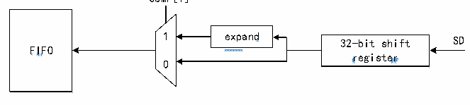
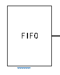

<!-- source-page: 788 -->

[← p.787](0787.md) · [index](../README.md) · [PDF p.788](https://ch32-riscv-ug.github.io/CH32H417/datasheet_en/CH32H417RM.PDF#page=788) · [p.789 →](0789.md)

<!-- header: CH32H417 Reference Manual https://wch-ic.com -->
The μ-Law standard, adopted in the United States and Japan, permits a 14-bit dynamic range (R32_SAI_xCFGR2  
register COMP[1:0] bits set to 10b). The European A-Law standard supports a 13-bit dynamic range  
(R32_SAI_xCFGR2 register COMP[1:0] bits set to 11b).  
Regarding the calculation method for μ-Law or A-Law compression/expansion standards, based on the setting of  
the CPL bit in the R32_SAI_xCFGR2 register, either 1&#x27;s complement or 2&#x27;s complement may be used for  
computation.  
In both μ-Law and A-Law standards, data is encoded in an 8-bit format aligned to the most significant bit (MSB),  
and the width of data after compression/expansion processing remains consistently 8 bits.  
Therefore, when the SAI audio module is enabled (R32_SAI_xCFGR1 register SAIEN bit set to 1) and either of  
these two compression/expansion modes is selected via the COMP[1:0] bits, the DS[2:0] bits of the  
R32_SAI_xCFGR1 register are forced to 010b. If no compression/expansion processing is required, the  
COMP[1:0] bits should remain cleared.  
Specifically, if the SAI audio module is configured as a transmitter and the COMP[1] bit in the  
R32_SAI_xCFGR2 register is set to 1, the compression mode is employed. If the SAI audio module is declared as  
a receiver, the expansion algorithm is used.  

Figure 36-12 Data compressed expansion hardware in audio module of SAI  
 <!-- rendered from the PDF; verify at https://ch32-riscv-ug.github.io/CH32H417/datasheet_en/CH32H417RM.PDF#page=788 -->

Receiver mode（bit MODE[0]=1 in R32_SAI_xCFGR1）  
COMP[1]  

🖼 Text parsed from the figure above

<!-- image: p788-draw-image-00002 inside the figure -->
<!-- image: p788-draw-image-00004 inside the figure -->
<!-- image: p788-draw-image-00005 inside the figure -->
1 expand 32-bit shift SD  
<!-- image: p788-draw-image-00007 inside the figure -->
<!-- image: p788-draw-image-00006 inside the figure -->
<!-- image: p788-draw-image-00003 inside the figure -->
FIFO  
register  
0  

Transmitter mode（bit MODE[0]=0 in R32_SAI_xCFGR1）  

 <!-- p788-draw-image-00008 rendered from the PDF -->

0  
<!-- image: p788-draw-image-00012 bbox=[348.24, 500.88, 427.44, 529.2] -->
<!-- image: p788-draw-image-00013 bbox=[357.36, 500.88, 422.64, 530.16] -->
32-bit shift SD  

🖼 Text parsed from the figure above

<!-- image: p788-draw-image-00009 inside the figure -->
FIFO  

<!-- image: p788-draw-image-00010 bbox=[250.32, 512.4, 298.8, 533.52] -->
<!-- image: p788-draw-image-00011 bbox=[259.44, 513.84, 289.2, 533.52] -->
register  
FIFO 1  
COMP[1]  
<em>Note: Not applicable when AC&#x27;97 is selected.</em>  
<strong>Output data line management on invalid Slot</strong>  
In the transmission mode, when an invalid Slot is transmitted on the data line, the behavior of SD line output can  
be controlled by TRIS bit.  
- When an invalid slot is transmitted, the SAI forces the SD output line to 0.
- After the last data bit is transmitted, the SD output line is placed in a high-impedance state to release the data
line for use by other transmitters connected to this node.  
2 transmitters must not simultaneously drive the same SD output pin to prevent short-circuit conditions. To ensure  
a gap exists during transmission, if the data is less than 32 bits, set the SLOTSZ[1:0] bits in the  
R32_SAI_xSLOTR register to 10b to expand the data to 32 bits. Subsequently, if the next slot is declared invalid,  
the SD output pin will be tri-stated at the end of the LSD of the valid slot (during the zero-padding phase to extend  
data to 32 bits).  
<!-- image: p788-draw-image-00001 bbox=[511.44, 786.36, 530.88, 796.68] -->
<!-- footer: V1.7 786 -->
